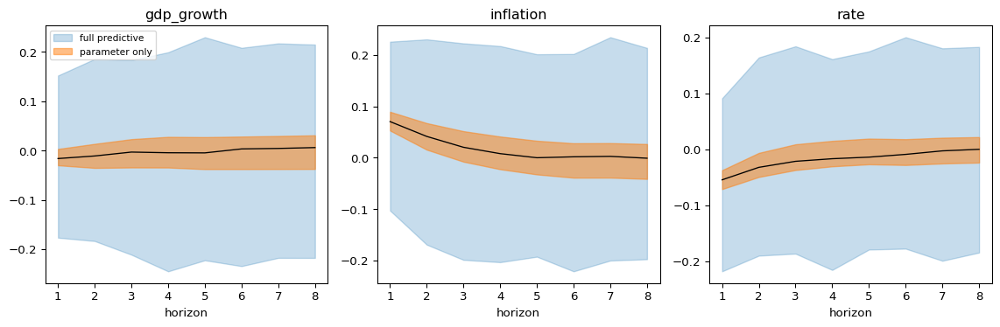

# Probabilistic Forecasts


Conventional VARs produce point forecasts. A Bayesian VAR produces a full posterior predictive distribution over future paths. This means every forecast comes with calibrated uncertainty — wide bands when the model is unsure, narrow when the data are informative.

That uncertainty has two sources: the model’s coefficients are only estimated, and the system is hit by a fresh random shock every period. `forecast()` includes both by default. The [section below](#what-the-bands-include) shows why leaving the shocks out — as much VAR tooling implicitly does — understates uncertainty, badly so at short horizons.

``` python
import numpy as np
import pandas as pd

from impulso import VAR, VARData
from impulso.samplers import NUTSSampler
```

## Setup

We repeat the data-generating process from the [quickstart tutorial](quickstart.md). The DGP is a VAR(1) with three macro variables — GDP growth, inflation, and an interest rate. If you’ve already worked through that notebook, the setup code below will be familiar.

``` python
rng = np.random.default_rng(42)
T = 200
n_vars = 3

A_true = np.array([
    [0.6, 0.0, -0.1],
    [0.2, 0.5, 0.0],
    [0.0, 0.15, 0.4],
])

y = np.zeros((T, n_vars))
for t in range(1, T):
    y[t] = A_true @ y[t - 1] + rng.standard_normal(n_vars) * 0.1

index = pd.date_range("2000-01-01", periods=T, freq="QS")
data = VARData(endog=y, endog_names=["gdp_growth", "inflation", "rate"], index=index)

sampler = NUTSSampler(draws=500, tune=500, chains=2, cores=1, random_seed=42)
fitted = VAR(lags=1, prior="minnesota").fit(data, sampler=sampler)
fitted
```

<style>
    :root {
        --column-width-1: 40%; /* Progress column width */
        --column-width-2: 15%; /* Chain column width */
        --column-width-3: 15%; /* Divergences column width */
        --column-width-4: 15%; /* Step Size column width */
        --column-width-5: 15%; /* Gradients/Draw column width */
    }
&#10;    .nutpie {
        max-width: 800px;
        margin: 10px auto;
        font-family: 'Segoe UI', Tahoma, Geneva, Verdana, sans-serif;
        //color: #333;
        //background-color: #fff;
        padding: 10px;
        box-shadow: 0 4px 6px rgba(0,0,0,0.1);
        border-radius: 8px;
        font-size: 14px; /* Smaller font size for a more compact look */
    }
    .nutpie table {
        width: 100%;
        border-collapse: collapse; /* Remove any extra space between borders */
    }
    .nutpie th, .nutpie td {
        padding: 8px 10px; /* Reduce padding to make table more compact */
        text-align: left;
        border-bottom: 1px solid #888;
    }
    .nutpie th {
        //background-color: #f0f0f0;
    }
&#10;    .nutpie th:nth-child(1) { width: var(--column-width-1); }
    .nutpie th:nth-child(2) { width: var(--column-width-2); }
    .nutpie th:nth-child(3) { width: var(--column-width-3); }
    .nutpie th:nth-child(4) { width: var(--column-width-4); }
    .nutpie th:nth-child(5) { width: var(--column-width-5); }
&#10;    .nutpie progress {
        width: 100%;
        height: 15px; /* Smaller progress bars */
        border-radius: 5px;
    }
    progress::-webkit-progress-bar {
        background-color: #eee;
        border-radius: 5px;
    }
    progress::-webkit-progress-value {
        background-color: #5cb85c;
        border-radius: 5px;
    }
    progress::-moz-progress-bar {
        background-color: #5cb85c;
        border-radius: 5px;
    }
    .nutpie .progress-cell {
        width: 100%;
    }
&#10;    .nutpie p strong { font-size: 16px; font-weight: bold; }
&#10;    @media (prefers-color-scheme: dark) {
        .nutpie {
            //color: #ddd;
            //background-color: #1e1e1e;
            box-shadow: 0 4px 6px rgba(0,0,0,0.2);
        }
        .nutpie table, .nutpie th, .nutpie td {
            border-color: #555;
            color: #ccc;
        }
        .nutpie th {
            background-color: #2a2a2a;
        }
        .nutpie progress::-webkit-progress-bar {
            background-color: #444;
        }
        .nutpie progress::-webkit-progress-value {
            background-color: #3178c6;
        }
        .nutpie progress::-moz-progress-bar {
            background-color: #3178c6;
        }
    }
</style>

<div class="nutpie">
    <p><strong>Sampler Progress</strong></p>
    <p>Total Chains: <span id="total-chains">2</span></p>
    <p>Active Chains: <span id="active-chains">0</span></p>
    <p>
        Finished Chains:
        <span id="active-chains">2</span>
    </p>
    <p>Sampling for now</p>
    <p>
        Estimated Time to Completion:
        <span id="eta">now</span>
    </p>
&#10;    <progress
        id="total-progress-bar"
        max="2000"
        value="2000">
    </progress>
    <table>
        <thead>
            <tr>
                <th>Progress</th>
                <th>Draws</th>
                <th>Divergences</th>
                <th>Step Size</th>
                <th>Gradients/Draw</th>
            </tr>
        </thead>
        <tbody id="chain-details">
            &#10;                <tr>
                    <td class="progress-cell">
                        <progress
                            max="1000"
                            value="1000">
                        </progress>
                    </td>
                    <td>1000</td>
                    <td>0</td>
                    <td>0.74</td>
                    <td>7</td>
                </tr>
            &#10;                <tr>
                    <td class="progress-cell">
                        <progress
                            max="1000"
                            value="1000">
                        </progress>
                    </td>
                    <td>1000</td>
                    <td>0</td>
                    <td>0.82</td>
                    <td>7</td>
                </tr>
            &#10;            </tr>
        </tbody>
    </table>
</div>

    FittedVAR(n_lags=1, data=VARData(endog_names=['gdp_growth', 'inflation', 'rate'], exog_names=None), var_names=['gdp_growth', 'inflation', 'rate'], volatility=Constant(name='constant', is_time_varying=False, sigma_sd_beta=2.5, tril_offdiag_sigma=0.5))

## Point forecasts

Call `.forecast(steps=8)` to produce an 8-step-ahead forecast. The result is a `ForecastResult` object that holds the full posterior predictive draws. The `.median()` method extracts the central tendency — the posterior median at each horizon.

``` python
fcast = fitted.forecast(steps=8)
fcast.median()
```

|     | gdp_growth | inflation | rate      |
|-----|------------|-----------|-----------|
| 0   | -0.012656  | 0.069556  | -0.052775 |
| 1   | -0.013128  | 0.032538  | -0.030248 |
| 2   | -0.008212  | 0.019128  | -0.010819 |
| 3   | -0.000685  | 0.004069  | -0.010505 |
| 4   | -0.005153  | -0.004712 | -0.010715 |
| 5   | -0.009687  | -0.018979 | -0.008123 |
| 6   | -0.011980  | -0.028681 | -0.003874 |
| 7   | -0.010367  | -0.019014 | -0.002091 |

Each row is a forecast horizon (1 through 8 quarters ahead). The values converge toward the unconditional mean of the process as the horizon increases — a hallmark of stationary VARs.

## Credible intervals

The `.hdi()` method computes the highest density interval at a given probability level. An 89% HDI means 89% of the posterior forecast mass falls within these bounds. We use 89% rather than 95% following the ArviZ convention — it avoids the false precision of round numbers.

``` python
hdi = fcast.hdi(prob=0.89)

print("Lower bounds:")
print(hdi.lower)
print("\nUpper bounds:")
print(hdi.upper)
```

    Lower bounds:
       gdp_growth  inflation      rate
    0   -0.176323  -0.092290 -0.205369
    1   -0.205131  -0.157166 -0.202808
    2   -0.221412  -0.181536 -0.184941
    3   -0.206683  -0.193314 -0.198503
    4   -0.206406  -0.207065 -0.198302
    5   -0.236575  -0.218074 -0.180260
    6   -0.226494  -0.234259 -0.212227
    7   -0.222014  -0.257147 -0.189988

    Upper bounds:
       gdp_growth  inflation      rate
    0    0.144030   0.223678  0.095839
    1    0.190039   0.215089  0.157698
    2    0.203153   0.224199  0.179956
    3    0.207867   0.225057  0.181995
    4    0.230420   0.207368  0.175023
    5    0.196664   0.200923  0.179835
    6    0.187660   0.198234  0.158418
    7    0.198557   0.178922  0.177154

The intervals widen at longer horizons. This is expected: two forces compound over time — the random shocks hitting the system accumulate, and parameter uncertainty propagates forward as each forecast step feeds into the next.

## Visualise the forecast

The `.plot()` method produces a fan chart showing the median forecast with shaded credible bands for each variable.

``` python
fig = fcast.plot()
```


The fan chart shows the posterior median (line) and 89% HDI (shaded region) for each variable. The bands widen at longer horizons, reflecting compounding uncertainty. GDP growth and the interest rate show the widest bands, consistent with their stronger cross-variable dependencies in the DGP.

## What the bands include

The forecast above is a genuine posterior predictive distribution: it composes *parameter uncertainty* (the coefficients are estimated, not known) with *shock uncertainty* (each future period draws a fresh innovation). This is the default — `include_shock_uncertainty=True`.

Setting `include_shock_uncertainty=False` switches the shocks off and propagates only the posterior over conditional-mean paths. The result is a distribution over what the model *expects* to happen, not over what *will* happen. It is the right object for scenario mechanics, but it is not a predictive distribution — and reporting it as one is a common way to understate forecast uncertainty. Pass `seed` in density mode to make the drawn shocks reproducible.

``` python
mean_fcast = fitted.forecast(steps=8, include_shock_uncertainty=False)
density_fcast = fitted.forecast(steps=8, include_shock_uncertainty=True, seed=42)

mean_hdi = mean_fcast.hdi(prob=0.89)
density_hdi = density_fcast.hdi(prob=0.89)
```

Plotting both 89% bands on the same axes shows the gap. The narrow inner band is parameter uncertainty alone; the wider band is the full predictive.

``` python
import matplotlib.pyplot as plt

horizons = range(1, 9)
fig, axes = plt.subplots(1, n_vars, figsize=(12, 4), squeeze=False)

for i, name in enumerate(data.endog_names):
    ax = axes[0][i]
    med = density_fcast.median()[name].values
    ax.fill_between(
        horizons, density_hdi.lower[name], density_hdi.upper[name],
        alpha=0.25, color="C0", label="full predictive",
    )
    ax.fill_between(
        horizons, mean_hdi.lower[name], mean_hdi.upper[name],
        alpha=0.5, color="C1", label="parameter only",
    )
    ax.plot(horizons, med, color="black", lw=1)
    ax.set_title(name)
    ax.set_xlabel("horizon")

axes[0][0].legend(loc="upper left", fontsize=8)
fig.tight_layout()
```



The understatement is worst at the shortest horizons. At `h=1`, parameter uncertainty is small — the data pin the coefficients down — so a mean-only band is almost invisible, yet the true one-step forecast still carries the full shock variance. The ratio of band widths makes this concrete:

``` python
width_mean = mean_hdi.upper - mean_hdi.lower
width_density = density_hdi.upper - density_hdi.lower

ratio = (width_density / width_mean).round(1)
ratio.index = range(1, 9)
ratio.index.name = "horizon"
ratio
```

|         | gdp_growth | inflation | rate |
|---------|------------|-----------|------|
| horizon |            |           |      |
| 1       | 9.9        | 9.0       | 9.1  |
| 2       | 7.6        | 7.7       | 8.2  |
| 3       | 6.9        | 7.1       | 8.1  |
| 4       | 7.1        | 6.6       | 8.3  |
| 5       | 7.0        | 6.0       | 7.7  |
| 6       | 6.7        | 6.3       | 8.2  |
| 7       | 6.5        | 6.5       | 8.2  |
| 8       | 6.3        | 6.1       | 8.1  |

Each entry is how many times wider the honest band is than the parameter-only band. The multiple is largest at `h=1` and shrinks as parameter uncertainty grows into the total — the opposite of the intuition that near-term forecasts are the certain ones.

## Tidy export

For downstream analysis or dashboarding, `.to_dataframe()` returns the median forecast in a tidy DataFrame format.

``` python
fcast.to_dataframe()
```

|      | gdp_growth | inflation | rate      |
|------|------------|-----------|-----------|
| step |            |           |           |
| 0    | -0.012656  | 0.069556  | -0.052775 |
| 1    | -0.013128  | 0.032538  | -0.030248 |
| 2    | -0.008212  | 0.019128  | -0.010819 |
| 3    | -0.000685  | 0.004069  | -0.010505 |
| 4    | -0.005153  | -0.004712 | -0.010715 |
| 5    | -0.009687  | -0.018979 | -0.008123 |
| 6    | -0.011980  | -0.028681 | -0.003874 |
| 7    | -0.010367  | -0.019014 | -0.002091 |

## Summary

Bayesian VAR forecasts provide more than point predictions. The full posterior predictive distribution lets you quantify and communicate forecast uncertainty honestly. For structural questions — what happens to inflation when the central bank raises rates? — see the [Structural Analysis tutorial](structural-analysis.md).

<section class="consulting-cta">

<p>

We currently have some <strong>availability for consulting</strong> on how Bayesian modelling, vector autoregressions, and impulso can be integrated into your team’s macroeconomic and financial forecasting work. If this sounds relevant, <a href="https://calendly.com/hello-1761-izqw/15-minute-meeting-clone-1">book an introductory call</a>. These calls are for consulting inquiries only. For technical usage questions and free community support, please use GitHub Discussions and the documentation.
</p>

</section>
