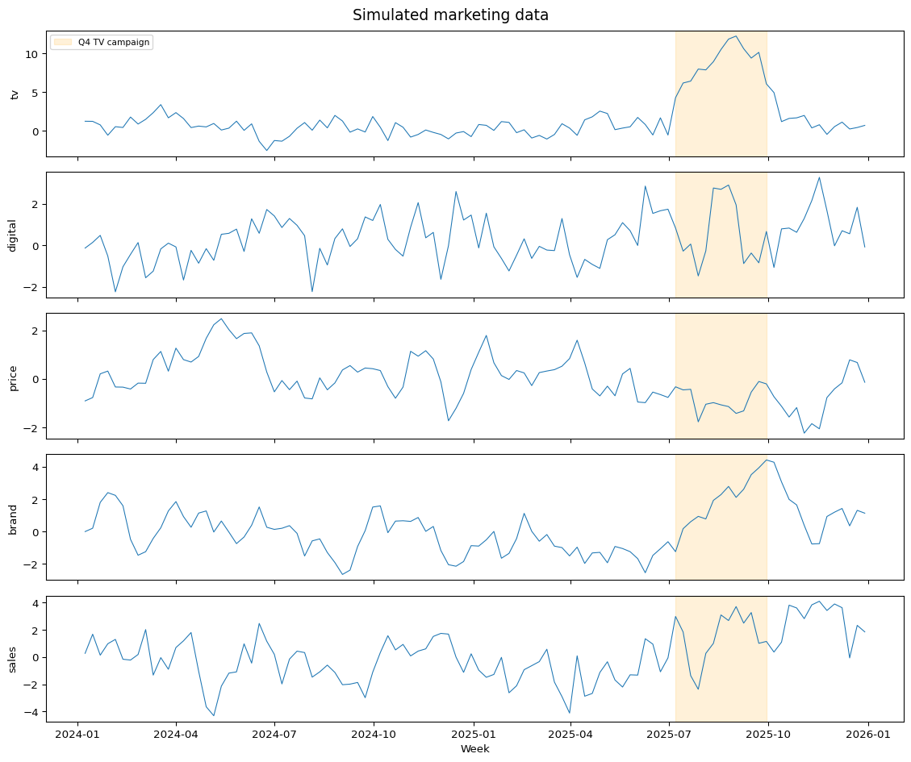
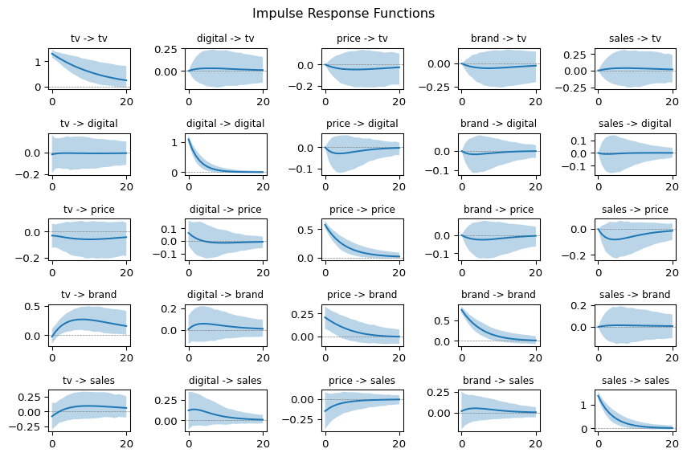
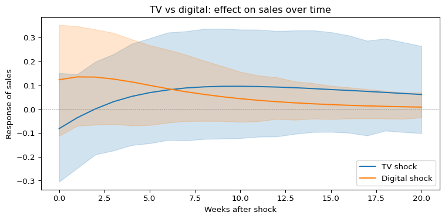
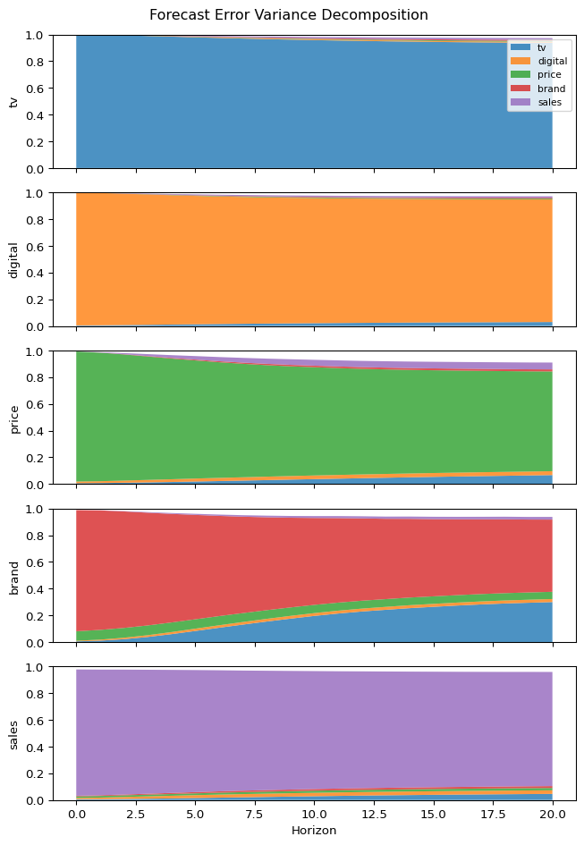
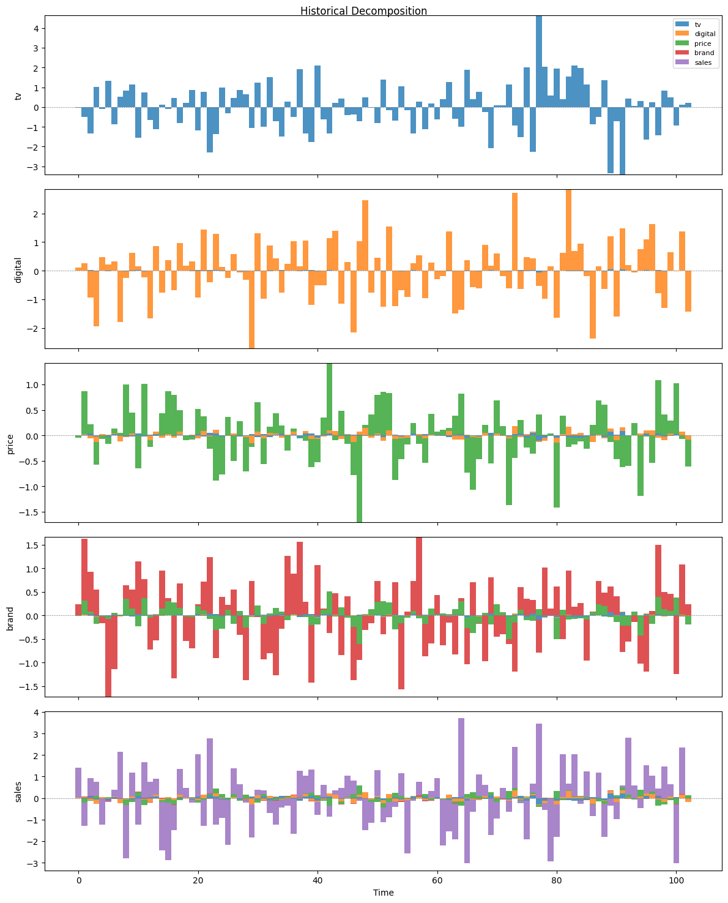

# Long-run and short-run effects of marketing spend: a structural VAR approach


A CMO at a consumer goods firm reviews the past year of marketing performance. Digital campaigns drove measurable spikes in weekly sales — the return was immediate and obvious. TV spend is harder to justify: the weekly numbers never show a clear lift. The CMO asks whether the firm should shift budget from TV to digital.

The answer depends on the evaluation window. A structural VAR fitted to marketing data can separate fast-decaying direct effects from slow-building indirect effects that flow through brand awareness. This notebook builds that analysis step by step, using simulated data with known dynamics so we can verify the model recovers the truth.

!!! note "Impulse Response Function"

    An impulse response function (IRF) traces the dynamic path of each variable
    following a one-time, one-unit structural shock over subsequent periods.

``` python
import arviz as az
import matplotlib.pyplot as plt
import numpy as np
import pandas as pd

from impulso import VAR, VARData, select_lag_order
from impulso.identification import Cholesky
from impulso.samplers import NUTSSampler
```

## 2. The data

The system has five weekly variables, ordered from most exogenous (set in advance by the marketing team) to most endogenous (observed as an outcome):

| Variable | Description | Role |
|----|----|----|
| `tv` | TV advertising spend (GRPs) | Planned weeks ahead, slow-acting |
| `digital` | Digital advertising spend (impressions) | Adjusted weekly, fast-acting |
| `price` | Average shelf price | Set by trade team, affects demand |
| `brand` | Brand awareness index | Mediates long-run ad effects |
| `sales` | Weekly unit sales | Outcome variable |

These are simulated from a VAR(2) with coefficients calibrated to published marketing elasticities. The key dynamics are: TV builds brand awareness slowly across multiple weeks; digital drives an immediate sales spike that decays quickly; brand awareness lifts sales persistently; and price increases hurt sales contemporaneously.

``` python
rng = np.random.default_rng(42)
T = 104 if not ci else 40
burn = 50
n_vars = 5
total = T + burn + 2  # +2 for initial lags

Y = np.zeros((total, n_vars))
innovations = rng.multivariate_normal(np.zeros(n_vars), Sigma_true, size=total)

# Inject Q4 TV campaign: weeks 78-90 (post-burn, only in full mode)
if not ci:
    campaign_start = burn + 2 + 78
    campaign_end = burn + 2 + 90
    innovations[campaign_start:campaign_end, 0] += 3.0

for t in range(2, total):
    Y[t] = A1_true @ Y[t - 1] + A2_true @ Y[t - 2] + innovations[t]

# Discard burn-in
Y = Y[burn + 2 :]

var_names = ["tv", "digital", "price", "brand", "sales"]
dates = pd.date_range("2024-01-08", periods=T, freq="W-MON")
df = pd.DataFrame(Y, columns=var_names, index=dates)
df.describe().round(2)
```

|       | tv     | digital | price  | brand  | sales  |
|-------|--------|---------|--------|--------|--------|
| count | 104.00 | 104.00  | 104.00 | 104.00 | 104.00 |
| mean  | 1.55   | 0.34    | -0.02  | 0.14   | 0.14   |
| std   | 3.01   | 1.16    | 0.97   | 1.51   | 1.90   |
| min   | -2.57  | -2.25   | -2.24  | -2.66  | -4.30  |
| 25%   | -0.00  | -0.39   | -0.70  | -0.98  | -1.15  |
| 50%   | 0.69   | 0.28    | -0.14  | 0.01   | 0.11   |
| 75%   | 1.66   | 1.12    | 0.57   | 1.13   | 1.30   |
| max   | 12.25  | 3.28    | 2.48   | 4.42   | 4.08   |

``` python
fig, axes = plt.subplots(5, 1, figsize=(12, 10), sharex=True)
for i, col in enumerate(var_names):
    axes[i].plot(df.index, df[col], linewidth=0.8)
    axes[i].set_ylabel(col)
    if not ci:
        campaign_start_date = dates[78]
        campaign_end_date = dates[min(90, T - 1)]
        axes[i].axvspan(campaign_start_date, campaign_end_date, alpha=0.15, color="orange", label="Q4 TV campaign" if i == 0 else None)
if not ci:
    axes[0].legend(loc="upper left", fontsize=8)
axes[-1].set_xlabel("Week")
fig.suptitle("Simulated marketing data", fontsize=14)
plt.tight_layout()
plt.show()
```



## 3. Fit the model

We fit a Bayesian VAR with a Minnesota prior. The lag order is chosen by BIC from an OLS pre-screen, then the full posterior is sampled via NUTS.

``` python
data = VARData.from_df(df, endog=var_names)
```

``` python
lag_result = select_lag_order(data, max_lags=6)
n_lags = lag_result.bic
print(f"BIC selects {n_lags} lags")
```

    BIC selects 1 lags

``` python
sampler = NUTSSampler(
    draws=3000 if not ci else 100,
    tune=1500 if not ci else 50,
    chains=4 if not ci else 1,
    cores=4 if not ci else 1,
    random_seed=123,
)
model = VAR(lags=n_lags, prior="minnesota")
fitted = model.fit(data, sampler=sampler)
```

<style>
    :root {
        --column-width-1: 40%; /* Progress column width */
        --column-width-2: 15%; /* Chain column width */
        --column-width-3: 15%; /* Divergences column width */
        --column-width-4: 15%; /* Step Size column width */
        --column-width-5: 15%; /* Gradients/Draw column width */
    }
&#10;    .nutpie {
        max-width: 800px;
        margin: 10px auto;
        font-family: 'Segoe UI', Tahoma, Geneva, Verdana, sans-serif;
        //color: #333;
        //background-color: #fff;
        padding: 10px;
        box-shadow: 0 4px 6px rgba(0,0,0,0.1);
        border-radius: 8px;
        font-size: 14px; /* Smaller font size for a more compact look */
    }
    .nutpie table {
        width: 100%;
        border-collapse: collapse; /* Remove any extra space between borders */
    }
    .nutpie th, .nutpie td {
        padding: 8px 10px; /* Reduce padding to make table more compact */
        text-align: left;
        border-bottom: 1px solid #888;
    }
    .nutpie th {
        //background-color: #f0f0f0;
    }
&#10;    .nutpie th:nth-child(1) { width: var(--column-width-1); }
    .nutpie th:nth-child(2) { width: var(--column-width-2); }
    .nutpie th:nth-child(3) { width: var(--column-width-3); }
    .nutpie th:nth-child(4) { width: var(--column-width-4); }
    .nutpie th:nth-child(5) { width: var(--column-width-5); }
&#10;    .nutpie progress {
        width: 100%;
        height: 15px; /* Smaller progress bars */
        border-radius: 5px;
    }
    progress::-webkit-progress-bar {
        background-color: #eee;
        border-radius: 5px;
    }
    progress::-webkit-progress-value {
        background-color: #5cb85c;
        border-radius: 5px;
    }
    progress::-moz-progress-bar {
        background-color: #5cb85c;
        border-radius: 5px;
    }
    .nutpie .progress-cell {
        width: 100%;
    }
&#10;    .nutpie p strong { font-size: 16px; font-weight: bold; }
&#10;    @media (prefers-color-scheme: dark) {
        .nutpie {
            //color: #ddd;
            //background-color: #1e1e1e;
            box-shadow: 0 4px 6px rgba(0,0,0,0.2);
        }
        .nutpie table, .nutpie th, .nutpie td {
            border-color: #555;
            color: #ccc;
        }
        .nutpie th {
            background-color: #2a2a2a;
        }
        .nutpie progress::-webkit-progress-bar {
            background-color: #444;
        }
        .nutpie progress::-webkit-progress-value {
            background-color: #3178c6;
        }
        .nutpie progress::-moz-progress-bar {
            background-color: #3178c6;
        }
    }
</style>

<div class="nutpie">
    <p><strong>Sampler Progress</strong></p>
    <p>Total Chains: <span id="total-chains">4</span></p>
    <p>Active Chains: <span id="active-chains">0</span></p>
    <p>
        Finished Chains:
        <span id="active-chains">4</span>
    </p>
    <p>Sampling for now</p>
    <p>
        Estimated Time to Completion:
        <span id="eta">now</span>
    </p>
&#10;    <progress
        id="total-progress-bar"
        max="18000"
        value="18000">
    </progress>
    <table>
        <thead>
            <tr>
                <th>Progress</th>
                <th>Draws</th>
                <th>Divergences</th>
                <th>Step Size</th>
                <th>Gradients/Draw</th>
            </tr>
        </thead>
        <tbody id="chain-details">
            &#10;                <tr>
                    <td class="progress-cell">
                        <progress
                            max="4500"
                            value="4500">
                        </progress>
                    </td>
                    <td>4500</td>
                    <td>0</td>
                    <td>0.61</td>
                    <td>7</td>
                </tr>
            &#10;                <tr>
                    <td class="progress-cell">
                        <progress
                            max="4500"
                            value="4500">
                        </progress>
                    </td>
                    <td>4500</td>
                    <td>0</td>
                    <td>0.55</td>
                    <td>7</td>
                </tr>
            &#10;                <tr>
                    <td class="progress-cell">
                        <progress
                            max="4500"
                            value="4500">
                        </progress>
                    </td>
                    <td>4500</td>
                    <td>0</td>
                    <td>0.59</td>
                    <td>7</td>
                </tr>
            &#10;                <tr>
                    <td class="progress-cell">
                        <progress
                            max="4500"
                            value="4500">
                        </progress>
                    </td>
                    <td>4500</td>
                    <td>0</td>
                    <td>0.58</td>
                    <td>7</td>
                </tr>
            &#10;            </tr>
        </tbody>
    </table>
</div>

## 4. Impulse response functions — short-run vs long-run

The Cholesky decomposition imposes a recursive ordering: variables listed earlier can affect later variables within the same week, but not vice versa. Our ordering (tv, digital, price, brand, sales) reflects the marketing planning process — ad budgets are set in advance, price is determined by the trade team before observing current-week sales, brand awareness responds within-week to advertising, and sales is the most endogenous variable.

``` python
identified = fitted.set_identification_strategy(Cholesky(ordering=var_names))
irf_result = identified.impulse_response(horizon=20)

irf_result.plot()
plt.show()
```



### The digital spike

The digital-to-sales panel shows a sharp spike at week 1 that decays rapidly toward zero by week 4. This is the direct, fast-acting channel: digital advertising drives immediate purchase behaviour, but the effect does not persist.

### The TV slow burn

The TV-to-sales panel tells a different story. The direct effect is small. But look at TV-to-brand: TV spend accumulates into brand awareness over several weeks, and brand-to-sales shows a persistent positive response. TV reaches sales indirectly, mediated through a brand channel that builds slowly but lasts.

``` python
irf_da = irf_result.idata.posterior_predictive["irf"]
horizons = irf_da.coords["horizon"].values

fig, ax = plt.subplots(figsize=(8, 4))
for shock, color, label in [("tv", "C0", "TV shock"), ("digital", "C1", "Digital shock")]:
    series = irf_da.sel(shock=shock, response="sales")
    med = series.median(dim=("chain", "draw")).values
    hdi = az.hdi(series, hdi_prob=0.89)["irf"]
    low = hdi.sel(hdi="lower").values
    high = hdi.sel(hdi="higher").values
    ax.plot(horizons, med, color=color, label=label)
    ax.fill_between(horizons, low, high, alpha=0.2, color=color)

ax.axhline(0, color="grey", linewidth=0.5, linestyle="--")
ax.set_xlabel("Weeks after shock")
ax.set_ylabel("Response of sales")
ax.set_title("TV vs digital: effect on sales over time")
ax.legend()
plt.tight_layout()
plt.show()
```



If you measure at week 1, digital wins. If you measure at week 16, TV wins. The evaluation window determines the conclusion, and the IRF makes the trade-off between the two channels visible.

## 5. Forecast error variance decomposition — which channel matters most?

We have seen that TV and digital have different *shapes* of effect on sales. FEVD answers the magnitude question: what fraction of sales forecast-error variance does each structural shock explain at each horizon?

``` python
fevd_result = identified.fevd(horizon=20)
```

``` python
fevd_result.plot()
plt.show()
```



At short horizons digital and price dominate the sales panel. At longer horizons TV’s share grows as the brand pathway accumulates. A marketer evaluating over different planning horizons would weight channels differently, and the FEVD gives them the object to reason about that with.

## 6. Historical decomposition — what drove the Q4 spike?

The DGP included a Q4 period where TV spend increased. Historical decomposition attributes each week’s deviation from the baseline to specific structural shocks.



Historical decomposition turns the IRF insight from “what would happen in theory” to “what did happen in this data”. It gives the marketer a retrospective accounting of which channels drove a specific observed outcome.

## 7. From IRFs to budget decisions

Three analytical objects, each answering a different question. Impulse response functions revealed the *shape* of each channel’s effect: digital acts fast and direct, while TV operates indirectly through brand awareness with a longer accumulation period. The forecast error variance decomposition quantified the *magnitude* of each channel’s contribution and showed how the ranking shifts as the evaluation horizon extends. Historical decomposition applied these dynamics to a concrete episode, attributing observed sales movements to specific structural shocks.

Return to the CMO’s question: should the firm shift budget from TV to digital? The answer depends on the planning horizon and strategic objectives. A firm optimising for next-week sales sees one answer; a firm investing in long-run brand equity sees another. The structural VAR does not make the decision — it makes the trade-off visible.
