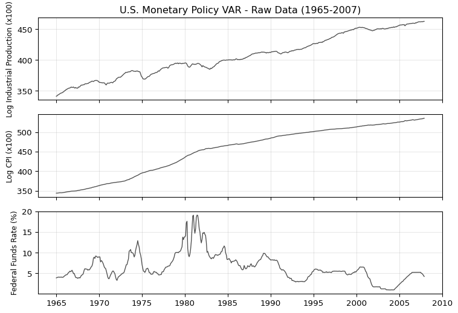
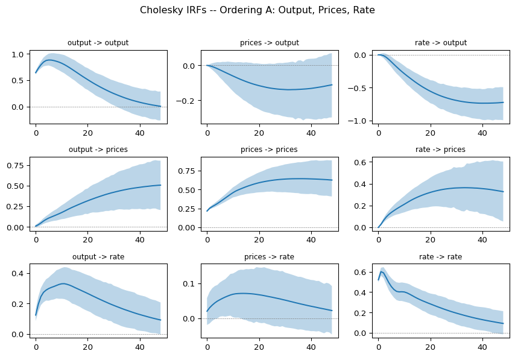
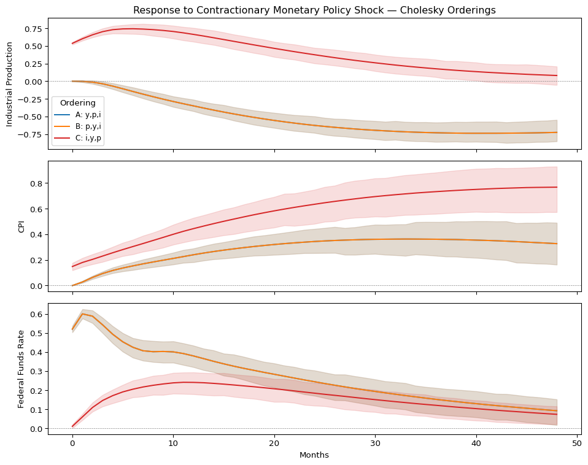
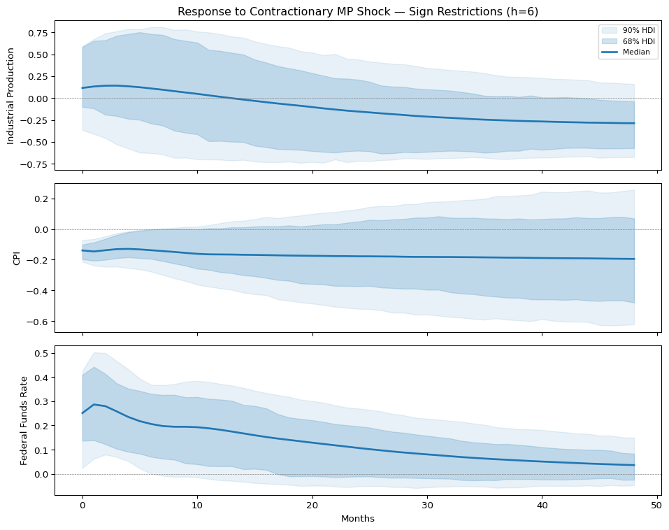
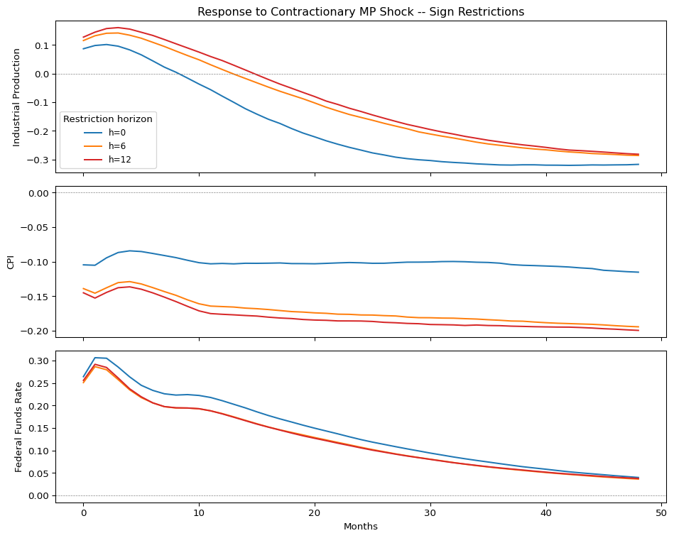
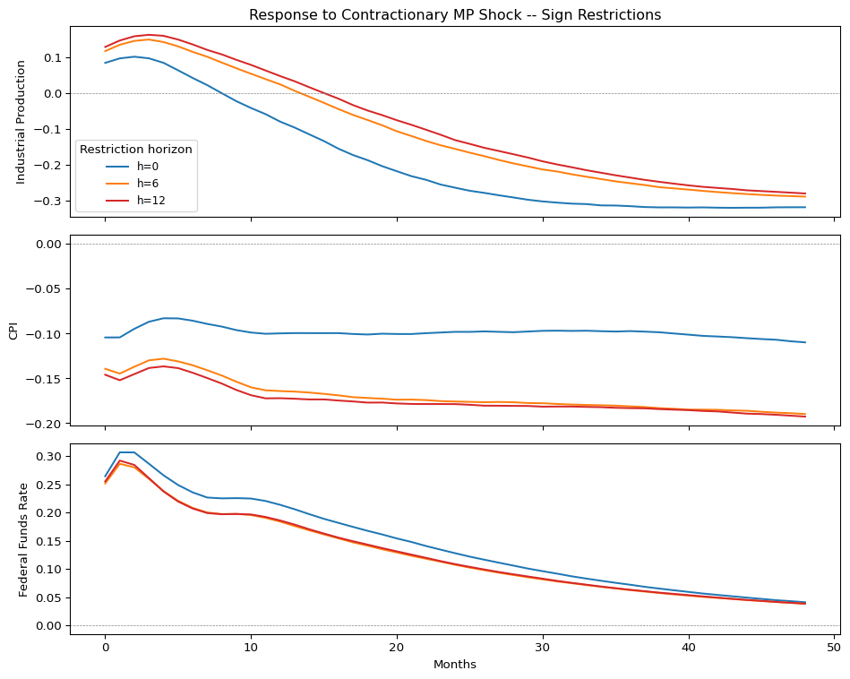

# Identification in structural VARs: Cholesky vs sign restrictions


## A case study using U.S. monetary policy data

The US Federal funds rate determines the overnight interest rate at which banks lend to each other, and it is the primary lever the U.S. central bank uses to influence the economy. In October 1979, Paul Volcker’s Federal Reserve raised the federal funds rate from 11% to over 17% in a matter of weeks. Industrial production fell. Unemployment rose. Inflation, eventually, came down. Most macroeconomists agree on this basic narrative: the Fed tightened, and the economy contracted.

But suppose you did not know the history and only had the data. You would see that output, prices, and interest rates move together over time. You would not know *why*. Did the Fed raise rates, causing output to fall? Or did output fall for other reasons, prompting the Fed to respond? The raw correlations are consistent with both stories, and with many others.

A vector autoregression (VAR) captures these co-movements in a system of linear equations, where each variable depends on its own past and the past of the other variables. The residuals from this system tell you what is left after accounting for predictable dynamics. But those residuals are correlated across equations. Disentangling them into economically meaningful shocks e.g., a monetary policy shock, requires additional assumptions beyond what the data can provide. In structural equation modelling we say that the reduced-form residuals are mixtures of latent orthogonal shocks, and recovering those shocks requires restrictions that the data alone cannot supply. This is the identification problem, and how you solve it determines what you conclude. In this notebook we’ll present and compare two identification strategies - the Cholesky decomposition and the sign restriction.

At a high-level, the Cholesky decomposition imposes a recursive ordering among the variables whereby variable 1 can affect all others contemporaneously, variable 2 can affect all except variable 1, and so on. The triangular structure of the Cholesky factor maps directly to these causal restrictions, delivering a unique structural decomposition for each posterior draw. Change the ordering and you change the answer. Meanwhile a Sign restrictions impose qualitative constraints on the *direction* of responses (e.g., “a contractionary monetary shock does not increase prices”). Instead of a single decomposition, you get a *set* of admissible decompositions. The credible bands are wider, but they reflect genuine uncertainty about identification that Cholesky hides.

By running both identification strategies on the same data, we can see observe how assumptions drive conclusions: how the ordering matters, why the *price puzzle* appears (the counterintuitive finding that prices *rise* after an estimated monetary tightening) and what it signals, and why wider bands under sign restrictions are not a failure but an honest accounting of what the data alone can tell us.

!!! note "Impulse Response Function"

    A central analytical object in this notebook is the impulse response function (IRF): the dynamic path of each variable following a one-time, one-unit structural shock, traced out over subsequent periods. IRFs answer questions like “if the central bank unexpectedly raises rates today, what happens to output over the next four years?”

``` python
import arviz as az
import matplotlib.pyplot as plt
import numpy as np
import pandas as pd

from impulso import VAR, VARData, select_lag_order
from impulso.identification import Cholesky, SignRestriction
from impulso.samplers import NUTSSampler
```

## Data

We use the three-variable system that forms the basis of many monetary policy structural VAR (SVAR) models ([Sims (1980)](https://www.jstor.org/stable/1912017)):

| Variable | FRED code  | What it measures                 | Transformation    |
|----------|------------|----------------------------------|-------------------|
| output   | `INDPRO`   | Industrial production index      | $100 \times \log$ |
| prices   | `CPIAUCSL` | Consumer price index (all urban) | $100 \times \log$ |
| rate     | `FEDFUNDS` | Effective federal funds rate     | Level (%)         |

Whilst GDP is measured quarterly, industrial production (`output`) offers a more granular monthly measure of real economic activity. The consumer price index (CPI, `prices`) captures the price level, and the federal funds rate (`rate`) is the rate the Fed controls directly to steer the economy. By raising the rate, the Fed makes borrowing more expensive, which slows spending and investment; by lowering it, the Fed stimulates activity. Together, these three variables form the minimal system needed to study how monetary policy affects the real economy and prices.

The sample we’ll be using here runs from January 1965 to December 2007. The start date captures the period when the Fed began actively setting short-term interest rates as its primary policy tool. The end date is deliberate: from December 2008 onward, the funds rate sat at the *zero lower bound* (effectively zero), thus leaving no room for conventional rate cuts and subsequently breaking the identification of monetary policy shocks via interest rate movements. You cannot identify a “surprise tightening” when the rate cannot move. Industrial production and CPI enter the VAR as $100 \times \log(\cdot)$, so a one-unit change is approximately a one-percent change. The federal funds rate enters in levels (percentage points).

!!! note "Differencing"

    We do not difference the data. [Sims, Stock, and Watson (1990)](https://www.princeton.edu/~mwatson/papers/Sims_Stock_Watson_Ecta_1990.pdf) showed that Bayesian inference in levels VARs is valid regardless of whether the series have unit roots, and differencing can distort impulse responses when variables are cointegrated.

<details class="code-fold">
<summary>Code</summary>

``` python
df = pd.read_csv("data/monetary_policy.csv", index_col="date", parse_dates=True)
df.describe().round(2)

fig, axes = plt.subplots(3, 1, figsize=(8, 5.5), sharex=True)
labels = {
    "output": "Log Industrial Production (x100)",
    "prices": "Log CPI (x100)",
    "rate": "Federal Funds Rate (%)",
}

for ax, col in zip(axes, df.columns, strict=True):
    ax.plot(df.index, df[col], linewidth=1, color="0.3")
    ax.set_ylabel(labels[col], fontsize=9)
    ax.grid(alpha=0.3)

axes[0].set_title("U.S. Monetary Policy VAR - Raw Data (1965-2007)")
fig.tight_layout()
```

</details>



## Reduced-form VAR estimation

The reduced-form VAR($p$) model is:

$$y_t = c + A_1 y_{t-1} + A_2 y_{t-2} + \cdots + A_p y_{t-p} + u_t, \qquad u_t \sim N(0, \Sigma_u)$$

where $y_t = (\text{output}_t, \text{prices}_t, \text{rate}_t)'$ is the $3 \times 1$ vector of endogenous variables, $c$ is a vector of intercepts, and $A_1, \ldots, A_p$ are $3 \times 3$ coefficient matrices. Each $A_j$ captures how the variables at lag $j$ feed back into the current period. The term $u_t$ is the reduced-form residual and quantifies what is left over after the systematic linear dependence on past values has been accounted for.

The $\Sigma_u$ matrix allows us to capture correlation of residuals across. Consequently, the off-diagonal elements of $\Sigma_u$ tell us tell us how any two series covary. However, they do not tell us which caused which and it is precisely this ambiguity that is addressed in the identification problem.

We estimate this model with a Minnesota prior. The idea behind Minnesota is simple: most macroeconomic time series look roughly like random walks, so a good starting point is to shrink each variable’s own first lag toward 1 and everything else toward 0. Cross-variable lags get shrunk harder than own lags, and higher lags get shrunk harder than lower ones. The prior is governed by three key hyperparameters: the *overall tightness* $\lambda_1$ which determines how strongly all coefficients are shrunk toward the prior. Larger values give the data more influence, whilst smaller values increase the prior’s influence on the posterior. The *cross-variable shrinkage* $\lambda_2$ is the strength of the shrinkage applied to cross-variable lags. Finally, the *lag decay* $\lambda_3$ measures the rate of increasing shrinkage that is applied as the lags’ order increases. This regularisation is important for monthly VARs with many lags, where the number of free parameters (here $3 \times 3 \times 12 = 108$ in the $A$ matrices alone, plus 3 intercepts) can overwhelm the data.

The standard choice for monthly monetary policy VARs is 12 lags as this allows the model to capture up to one year of dynamic feedback. We follow this convention for comparability with published results ([Christiano, Eichenbaum, and Evans, 1999](https://faculty.wcas.northwestern.edu/lchrist/research/Handbook/paper2.pdf); [Uhlig, 2005](https://www.sciencedirect.com/science/article/abs/pii/S0304393205000073)).

``` python
if ci:
    sampler = NUTSSampler(draws=10, tune=50, chains=1, cores=1, random_seed=123)
else:
    sampler = NUTSSampler(
        draws=1500,
        tune=3000,
        chains=8,
        cores=8,
        random_seed=123,
        target_accept=0.9,
        nuts_sampler="nutpie",
    )

data = VARData.from_df(df, endog=["output", "prices", "rate"])
fitted = VAR(lags=12, prior="minnesota").fit(data, sampler=sampler)
az.summary(fitted.idata, var_names=["intercept"], kind="diagnostics")
```

<style>
    :root {
        --column-width-1: 40%; /* Progress column width */
        --column-width-2: 15%; /* Chain column width */
        --column-width-3: 15%; /* Divergences column width */
        --column-width-4: 15%; /* Step Size column width */
        --column-width-5: 15%; /* Gradients/Draw column width */
    }
&#10;    .nutpie {
        max-width: 800px;
        margin: 10px auto;
        font-family: 'Segoe UI', Tahoma, Geneva, Verdana, sans-serif;
        //color: #333;
        //background-color: #fff;
        padding: 10px;
        box-shadow: 0 4px 6px rgba(0,0,0,0.1);
        border-radius: 8px;
        font-size: 14px; /* Smaller font size for a more compact look */
    }
    .nutpie table {
        width: 100%;
        border-collapse: collapse; /* Remove any extra space between borders */
    }
    .nutpie th, .nutpie td {
        padding: 8px 10px; /* Reduce padding to make table more compact */
        text-align: left;
        border-bottom: 1px solid #888;
    }
    .nutpie th {
        //background-color: #f0f0f0;
    }
&#10;    .nutpie th:nth-child(1) { width: var(--column-width-1); }
    .nutpie th:nth-child(2) { width: var(--column-width-2); }
    .nutpie th:nth-child(3) { width: var(--column-width-3); }
    .nutpie th:nth-child(4) { width: var(--column-width-4); }
    .nutpie th:nth-child(5) { width: var(--column-width-5); }
&#10;    .nutpie progress {
        width: 100%;
        height: 15px; /* Smaller progress bars */
        border-radius: 5px;
    }
    progress::-webkit-progress-bar {
        background-color: #eee;
        border-radius: 5px;
    }
    progress::-webkit-progress-value {
        background-color: #5cb85c;
        border-radius: 5px;
    }
    progress::-moz-progress-bar {
        background-color: #5cb85c;
        border-radius: 5px;
    }
    .nutpie .progress-cell {
        width: 100%;
    }
&#10;    .nutpie p strong { font-size: 16px; font-weight: bold; }
&#10;    @media (prefers-color-scheme: dark) {
        .nutpie {
            //color: #ddd;
            //background-color: #1e1e1e;
            box-shadow: 0 4px 6px rgba(0,0,0,0.2);
        }
        .nutpie table, .nutpie th, .nutpie td {
            border-color: #555;
            color: #ccc;
        }
        .nutpie th {
            background-color: #2a2a2a;
        }
        .nutpie progress::-webkit-progress-bar {
            background-color: #444;
        }
        .nutpie progress::-webkit-progress-value {
            background-color: #3178c6;
        }
        .nutpie progress::-moz-progress-bar {
            background-color: #3178c6;
        }
    }
</style>

<div class="nutpie">
    <p><strong>Sampler Progress</strong></p>
    <p>Total Chains: <span id="total-chains">8</span></p>
    <p>Active Chains: <span id="active-chains">0</span></p>
    <p>
        Finished Chains:
        <span id="active-chains">8</span>
    </p>
    <p>Sampling for 3 minutes</p>
    <p>
        Estimated Time to Completion:
        <span id="eta">now</span>
    </p>
&#10;    <progress
        id="total-progress-bar"
        max="36000"
        value="36000">
    </progress>
    <table>
        <thead>
            <tr>
                <th>Progress</th>
                <th>Draws</th>
                <th>Divergences</th>
                <th>Step Size</th>
                <th>Gradients/Draw</th>
            </tr>
        </thead>
        <tbody id="chain-details">
            &#10;                <tr>
                    <td class="progress-cell">
                        <progress
                            max="4500"
                            value="4500">
                        </progress>
                    </td>
                    <td>4500</td>
                    <td>0</td>
                    <td>0.01</td>
                    <td>1023</td>
                </tr>
            &#10;                <tr>
                    <td class="progress-cell">
                        <progress
                            max="4500"
                            value="4500">
                        </progress>
                    </td>
                    <td>4500</td>
                    <td>0</td>
                    <td>0.01</td>
                    <td>1023</td>
                </tr>
            &#10;                <tr>
                    <td class="progress-cell">
                        <progress
                            max="4500"
                            value="4500">
                        </progress>
                    </td>
                    <td>4500</td>
                    <td>0</td>
                    <td>0.01</td>
                    <td>1023</td>
                </tr>
            &#10;                <tr>
                    <td class="progress-cell">
                        <progress
                            max="4500"
                            value="4500">
                        </progress>
                    </td>
                    <td>4500</td>
                    <td>0</td>
                    <td>0.01</td>
                    <td>1023</td>
                </tr>
            &#10;                <tr>
                    <td class="progress-cell">
                        <progress
                            max="4500"
                            value="4500">
                        </progress>
                    </td>
                    <td>4500</td>
                    <td>0</td>
                    <td>0.01</td>
                    <td>1023</td>
                </tr>
            &#10;                <tr>
                    <td class="progress-cell">
                        <progress
                            max="4500"
                            value="4500">
                        </progress>
                    </td>
                    <td>4500</td>
                    <td>0</td>
                    <td>0.01</td>
                    <td>1023</td>
                </tr>
            &#10;                <tr>
                    <td class="progress-cell">
                        <progress
                            max="4500"
                            value="4500">
                        </progress>
                    </td>
                    <td>4500</td>
                    <td>0</td>
                    <td>0.01</td>
                    <td>1023</td>
                </tr>
            &#10;                <tr>
                    <td class="progress-cell">
                        <progress
                            max="4500"
                            value="4500">
                        </progress>
                    </td>
                    <td>4500</td>
                    <td>0</td>
                    <td>0.01</td>
                    <td>1023</td>
                </tr>
            &#10;            </tr>
        </tbody>
    </table>
</div>

|                | mcse_mean | mcse_sd | ess_bulk | ess_tail | r_hat |
|----------------|-----------|---------|----------|----------|-------|
| intercept\[0\] | 0.008     | 0.005   | 4909.0   | 7214.0   | 1.00  |
| intercept\[1\] | 0.004     | 0.002   | 2981.0   | 5753.0   | 1.01  |
| intercept\[2\] | 0.009     | 0.005   | 3626.0   | 6619.0   | 1.00  |

The sampler has converged well: no divergences, R-hat close to 1, and effective sample sizes comfortably above 1000.

!!! note "Prior Sensitivity"

    A note on prior sensitivity: we use the default Minnesota prior hyperparameters from impulso throughout this notebook. The tightness $\lambda_1$, cross-variable shrinkage $\lambda_2$, and lag decay $\lambda_3$ (introduced above) all affect the posterior and hence the impulse responses. A full prior sensitivity analysis involving varying $\lambda_1$ across a range like 0.05 to 0.5 would be a valuable robustness exercise, but we defer it here to keep the focus on identification. The reader should be aware that the choice of prior is an additional modelling decision on top of the identification strategy, and in principle both should be subjected to sensitivity analysis in applied work.

## The identification problem

We now have posterior draws of the reduced-form parameters: the coefficient matrices $A_1, \ldots, A_p$ and the residual covariance $\Sigma_u$. The reduced-form residuals $u_t$ are correlated across equations, but we want to recover the *structural* shocks $\varepsilon_t$. Unlike the reduced-form residuals, these structural are orthogonal latent variables from which we can elicit a causal interpretation.

Throughout this notebook, the term *“structural”* is used to mean *“given a causal interpretation by the identifying assumptions.”*. The structural model assumes:

$$u_t = B_0 \, \varepsilon_t, \qquad \varepsilon_t \sim N(0, I_n)$$

where $B_0$ is the $n \times n$ structural impact matrix. Column $j$ of $B_0$ describes how a one-standard-deviation structural shock $j$ moves each variable on impact. The orthogonality assumption $\text{Var}(\varepsilon_t) = I_n$ means the structural shocks are uncorrelated and unit-variance, so all the interesting structure lives in $B_0$.

Since $\Sigma_u = \text{Var}(u_t) = B_0 \, B_0'$, we can, in principle, recover $B_0$ from $\Sigma_u$. But here is the problem: for $n = 3$ variables, the symmetric matrix $\Sigma_u$ has $n(n+1)/2 = 6$ unique elements. The matrix $B_0$ has $n^2 = 9$ free entries. Six equations, nine unknowns. We are three restrictions short. Without additional restrictions, there are infinitely many matrices $B_0$ that satisfy $\Sigma_u = B_0 B_0'$. If $B_0$ is one solution, then $B_0 Q$ is another for any orthogonal matrix $Q$ since $B_0 Q (B_0 Q)' = B_0 Q Q' B_0' = B_0 B_0' = \Sigma_u$. The data cannot tell these apart. The choice of $Q$ is, precisely, the identification problem.

!!! note "A note on Orthogonalisation"

    It is worth pausing on why this works. An orthogonal matrix $Q$ satisfies $Q Q' = I_n$ i.e., it is a rotation that preserves lengths and angles. When we form $B_0 Q$, we are rotating the columns of $B_0$, the implication of which is that we are redistributing the structural shocks into new linear combinations without changing the covariance they imply. Every such rotation gives a different economic story (different shocks, different impulse responses) that is equally consistent with the observed data.

The identification problem is not a generic “too many unknowns” issue; it is specifically a *rotational* indeterminacy, and the two strategies below differ in how they resolve it: Cholesky pins the rotation to the identity by choosing the unique lower-triangular factor, while sign restrictions accept all rotations that satisfy qualitative constraints.

## Cholesky identification

The Cholesky decomposition factors $\Sigma_u$ into $L L'$ where $L$ is lower triangular with positive diagonal entries. Setting $B_0 = L$ gives us a structural impact matrix where the zeros above the diagonal carry specific economic meaning determined by the variable ordering. Our baseline ordering is: output, prices, rate. Written out, $B_0$ looks like:

$$B_0 = \begin{pmatrix} * & 0 & 0 \\ * & * & 0 \\ * & * & * \end{pmatrix}$$

Read column by column. The first column is the “output shock”: it can move all three variables on impact. The second column is the “price shock”: it can move prices and the rate, but not output as there is a zero in position $(1,2)$. The third column is the “rate shock” (our monetary policy shock): it can only move the rate on impact, not output or prices, again because there are zeros in positions $(1,3)$ and $(2,3)$. What does this mean economically? The zeros say that output and prices are “sluggish” within the month and cannot respond contemporaneously to a monetary policy shock. The Fed, by contrast, sits in the last row and can see and respond to everything. This is a timing assumption: it takes at least one month for a change in the funds rate to show up in industrial production or consumer prices, but the Federal Open Market Committee (FOMC) - the body that sets the funds rate - can observe current economic conditions and adjust policy within the month. The monetary policy shock itself is the residual variation in the funds rate equation after removing the predicted response to current output and prices (i.e., the part not explained by the linear model). If the Fed raises rates by more than its usual reaction to the current state of the economy, the excess is the *“shock”*. This is a defensible set of assumptions for monthly data, but it is not the only defensible set. The three zeros are doing real work, and different orderings will give different answers.

``` python
ordering_a = ["output", "prices", "rate"]
identified_chol_a = fitted.set_identification_strategy(Cholesky(ordering=ordering_a))

irf_chol_a = identified_chol_a.impulse_response(horizon=48)
fig = irf_chol_a.plot()
fig.suptitle("Cholesky IRFs -- Ordering A: Output, Prices, Rate", y=1.02)
```

    Text(0.5, 1.02, 'Cholesky IRFs -- Ordering A: Output, Prices, Rate')



The 3x3 grid above shows every shock-response pair. The panel of figures may be read as “column shock causes row response.” Focussing on the third column, the rate shock, we note that because output and CPI enter as $100 \times \log$, a one-unit change in those series is approximately a one-percentage-point change.

- **rate -\> output** (top right): Industrial production drops sharply after a contractionary monetary shock, falling by about 0.5 to 1.0 percentage points over 48 months. This is the standard transmission mechanism: higher rates make borrowing more expensive, which reduces investment and consumption, which in turn reduces output. The response is persistent, with no clear sign of returning to zero within 4 years.
- **rate -\> rate** (bottom right): The rate shock itself starts at about 0.6 percentage points and decays gradually. The policy tightening is partially reversed over time, consistent with the Fed easing as the economy weakens.
- **rate -\> prices** (middle right): Here is the problem. After a contractionary monetary shock, prices *rise*. The CPI response is positive, reaching about 0.3-0.4 over 48 months.

This is the *price puzzle*. Higher interest rates reduce demand, which should put downward pressure on prices, yet the estimated response goes the wrong way.Why does this happen? The most common explanation: the Fed raises rates when it expects future inflation. A three-variable VAR cannot capture the full set of data and signals the Fed uses when making decisions, so the “surprise” component of the rate change still contains a predictable response to anticipated inflation. The subsequent price increase is not caused by the rate hike; it is the inflation the Fed saw coming. The “shock” is not really a shock.

### Sensitivity to variable ordering

If the Cholesky ordering embodies economic assumptions, then changing the ordering changes the assumptions and will, consequently, change the results. Let us see by how much. We compare three orderings, each implying a different contemporaneous causal structure:- **Ordering A (baseline):** output, prices, rate. Output and prices are sluggish; the Fed sees everything.- **Ordering B:** prices, output, rate. Prices ordered before output, so prices can affect output contemporaneously but not vice versa. The Fed still sees everything.- **Ordering C:** rate, output, prices. The interest rate is ordered *first*, meaning it is assumed to be the most exogenous variable, unable to respond to current output or prices within the month. This contradicts how monetary policy actually works: the FOMC meets roughly every six weeks, reviews current economic data, and explicitly sets the rate in response to output and inflation conditions. Treating the rate as exogenous removes exactly this feedback. It is instructive to see what happens when the ordering is wrong.

``` python
# Ordering B: prices, output, rate
ordering_b = ["prices", "output", "rate"]
identified_chol_b = fitted.set_identification_strategy(Cholesky(ordering=ordering_b))
irf_chol_b = identified_chol_b.impulse_response(horizon=48)

# Ordering C: rate, output, prices (rate most exogenous)
ordering_c = ["rate", "output", "prices"]
identified_chol_c = fitted.set_identification_strategy(Cholesky(ordering=ordering_c))
irf_chol_c = identified_chol_c.impulse_response(horizon=48)
```

<details class="code-fold">
<summary>Code</summary>

``` python
response_vars = ["output", "prices", "rate"]
response_labels = {
    "output": "Industrial Production",
    "prices": "CPI",
    "rate": "Federal Funds Rate",
}
horizons = np.arange(49)

fig, axes = plt.subplots(3, 1, figsize=(10, 8), sharex=True)

for i, resp in enumerate(response_vars):
    ax = axes[i]

    for label, irf_result, colour in [
        ("A: y,p,i", irf_chol_a, "C0"),
        ("B: p,y,i", irf_chol_b, "C1"),
        ("C: i,y,p", irf_chol_c, "C3"),
    ]:
        irf_data = irf_result.idata.posterior_predictive["irf"]
        med_vals = (
            irf_data.sel(response=resp, shock="rate")
            .median(dim=("chain", "draw"))
            .values
        )
        hdi_ds = az.hdi(irf_data.sel(response=resp, shock="rate"), hdi_prob=0.68)
        hdi_vals = hdi_ds["irf"]

        ax.plot(horizons, med_vals, color=colour, label=label, linewidth=1.5)
        ax.fill_between(
            horizons,
            hdi_vals.sel(hdi="lower").values,
            hdi_vals.sel(hdi="higher").values,
            alpha=0.15,
            color=colour,
        )

    ax.axhline(0, color="grey", linewidth=0.5, linestyle="--")
    ax.set_ylabel(response_labels[resp])
    if i == 0:
        ax.legend(fontsize=9, title="Ordering")
        ax.set_title(
            "Response to Contractionary Monetary Policy Shock — Cholesky Orderings"
        )

axes[-1].set_xlabel("Months")
fig.tight_layout()
```

</details>



Let’s breakdown the different interpretations that can be drawn from the three orderings. Overall, orderings A and B produce *identical* impulse responses. This is not a coincidence. In both orderings, the federal funds rate sits in position 3 (last), so the monetary policy shock is the third column of the lower-triangular $B_0$, which depends only on the Cholesky factor’s third column. Swapping output and prices in positions 1 and 2 changes the output shock and the price shock, but leaves the monetary policy shock untouched. This is a useful structural insight: ordering sensitivity for a given shock depends on *where that shock’s variable sits in the ordering*, not on the full permutation. The monetary policy shock only changes when the rate moves to a different position, as in ordering C.

The takeaway here is that the ordering of variables is an important choice of the modeller, and different orderings can impose very different chains of causality. Considering the example here, we can see that the monetary policy shock is invariant to the ordering of variables that come *before* it, but changes fundamentally when the rate itself moves to a different position. Ordering C, which makes an economically implausible assumption about the Fed, gives a qualitatively different answer. These differences are not coming from the data. They come entirely from the three zeros we chose to impose.

## Sign restrictions

Sign restrictions take a different approach to the identification problem. Instead of asserting that specific elements of $B_0$ are exactly zero, we assert only the *direction* of certain responses e.g., “a contractionary monetary policy shock raises the interest rate” or “a contractionary monetary policy shock does not increase prices.” Any $B_0$ matrix consistent with these qualitative constraints is admissible. The collection of all such admissible decompositions is called the *identified set*.

The mechanics work as follows. For each posterior draw of $\Sigma_u$, we:

1.  Compute the Cholesky factor $L = \text{chol}(\Sigma_u)$.
2.  Draw a random orthogonal matrix $Q$ from the Haar distribution on $O(n)$ - the unique probability distribution over rotation matrices that is invariant to further rotation, making it the natural “uniform” distribution over orientations.
3.  Form the candidate structural impact matrix $\tilde{B}_0 = L Q$.
4.  Check whether the impulse responses implied by $\tilde{B}_0$ satisfy the sign conditions at all required horizons. If the restriction horizon is $h > 0$, we also need the moving-average (MA) coefficient matrices $\Phi_1, \ldots, \Phi_h$. These are computed recursively from the VAR coefficients: $\Phi_s = \sum_{j=1}^{\min(s,p)} A_j \Phi_{s-j}$ with $\Phi_0 = I_n$. The matrix $\Phi_s \tilde{B}_0$ then gives the structural impulse response at horizon $s$, and we check that it satisfies the sign conditions for $s = 0, 1, \ldots, h$.
5.  If the conditions hold, keep $\tilde{B}_0$. If not, draw another $Q$ and try again.

The result is not a single $B_0$ but a set of them, and the posterior distribution over impulse responses is correspondingly wider. This additional width reflects identification uncertainty: many structural models are consistent with the same reduced-form evidence and the same qualitative sign beliefs.Our baseline restrictions follow [Uhlig, (2005)](https://www.sciencedirect.com/science/article/abs/pii/S0304393205000073):

| Variable | Restriction | Rationale |
|----|----|----|
| rate | $\geq 0$ at horizons $0, \ldots, h$ | A contractionary shock raises the policy rate |
| prices | $\leq 0$ at horizons $0, \ldots, h$ | Higher rates reduce demand, which should put downward pressure on prices |
| output | Unrestricted | The output effect is what we want to learn from the data |

Leaving output unrestricted is the point. We want the data, not our priors, to tell us whether monetary contractions reduce output and by how much. If we restricted output to be non-positive, we would be assuming the answer to the question we are trying to ask.

We start with a restriction horizon of $h = 6$ months, then explore sensitivity to $h = 0$ (impact only) and $h = 12$ (one year).

``` python
scheme_h6 = SignRestriction(
    restrictions={
        "rate": {"monetary_policy": "+"},
        "prices": {"monetary_policy": "-"},
    },
    n_rotations=2000,
    restriction_horizon=6,
    random_seed=42,
)

identified_sr_h6 = fitted.set_identification_strategy(scheme_h6)
acceptance_rate = identified_sr_h6.idata.posterior.attrs.get("sign_restriction_acceptance_rate", "N/A")
print(
    f"Acceptance rate: {acceptance_rate:.1%}"
    if isinstance(acceptance_rate, float)
    else f"Acceptance rate: {acceptance_rate}"
)
```

    Acceptance rate: 100.0%

<details class="code-fold">
<summary>Code</summary>

``` python
irf_sr_h6 = identified_sr_h6.impulse_response(horizon=48)
irf_sr_data = irf_sr_h6.idata.posterior_predictive["irf"]
sr_shock_name = "monetary_policy"

fig, axes = plt.subplots(3, 1, figsize=(10, 8), sharex=True)

for i, resp in enumerate(response_vars):
    ax = axes[i]
    med_vals = irf_sr_data.sel(response=resp, shock=sr_shock_name).median(dim=("chain", "draw")).values
    hdi_68 = az.hdi(irf_sr_data.sel(response=resp, shock=sr_shock_name), hdi_prob=0.68)["irf"]
    hdi_90 = az.hdi(irf_sr_data.sel(response=resp, shock=sr_shock_name), hdi_prob=0.90)["irf"]

    ax.fill_between(
        horizons,
        hdi_90.sel(hdi="lower").values,
        hdi_90.sel(hdi="higher").values,
        alpha=0.1,
        color="C0",
        label="90% HDI" if i == 0 else None,
    )
    ax.fill_between(
        horizons,
        hdi_68.sel(hdi="lower").values,
        hdi_68.sel(hdi="higher").values,
        alpha=0.2,
        color="C0",
        label="68% HDI" if i == 0 else None,
    )
    ax.plot(horizons, med_vals, color="C0", linewidth=2, label="Median" if i == 0 else None)
    ax.axhline(0, color="grey", linewidth=0.5, linestyle="--")
    ax.set_ylabel(response_labels[resp])
    if i == 0:
        ax.legend(fontsize=8)

axes[0].set_title("Response to Contractionary MP Shock — Sign Restrictions (h=6)")
axes[-1].set_xlabel("Months")
fig.tight_layout()
```

</details>



The three panels above show how each variable responds to the identified monetary policy shock under sign restrictions with $h = 6$.

In the upper panel, the median response is slightly positive for the first few months, then turns negative, reaching about -0.25 by month 48. But look at the credible bands: they span from roughly +0.75 to -0.60 in the first year. The data, combined with only two sign restrictions, cannot tell us whether output rises or falls in the short run. This is exactly what Uhlig (2005) found: the output response to a monetary contraction is ambiguous under these restrictions. The sign restrictions on prices and the interest rate alone are not enough to pin down the monetary transmission mechanism.

Considering the prices (middle panel), the CPI response is negative by construction, hovering around -0.15 to -0.20. There is no price puzzle here, but that is not a victory for the model. We *imposed* that prices cannot rise. The absence of the puzzle is an assumption, not a finding.

Finally, in the bottom panel we see that interest rate rises on impact (about 0.25 percentage points) and decays gradually, consistent with a contractionary shock that is partially reversed over time.

Compare these bands with the Cholesky IRFs above. The sign restriction bands are much wider, especially for output. This additional width stems from the additional identification uncertainty - the data are consistent with many different structural decompositions, and sign restrictions honestly report this. The Cholesky bands are narrower because the three zero restrictions eliminate all but one decomposition. Whether that precision is real or artificial depends on whether you believe the zeros.

### Restriction horizon sensitivity

The restriction horizon $h$ is a free parameter, and it matters. When $h = 0$, the sign conditions are checked only at impact. When $h = 12$, the conditions must hold for a full year of impulse response dynamics, which is more demanding. Longer horizons shrink the identified set and can tighten the bands, though the effect depends on how constraining the restrictions are relative to the dynamics the data support.

``` python
results_sr = {}
for h in [0, 6, 12]:
    scheme = SignRestriction(
        restrictions={
            "rate": {"monetary_policy": "+"},
            "prices": {"monetary_policy": "-"},
        },
        n_rotations=2000,
        restriction_horizon=h,
        random_seed=42,
    )
    ident = fitted.set_identification_strategy(scheme)
    ar = ident.idata.posterior.attrs.get("sign_restriction_acceptance_rate", float("nan"))
    results_sr[h] = {
        "identified": ident,
        "irf": ident.impulse_response(horizon=48),
        "acceptance_rate": ar,
    }
    print(f"h={h:>2}: acceptance rate = {ar:.1%}")
```

    h= 0: acceptance rate = 100.0%
    h= 6: acceptance rate = 100.0%
    h=12: acceptance rate = 100.0%

<details class="code-fold">
<summary>Code</summary>

``` python
fig, axes = plt.subplots(3, 1, figsize=(10, 8), sharex=True)

for i, resp in enumerate(response_vars):
    ax = axes[i]

    for h, colour in [(0, "C0"), (6, "C1"), (12, "C3")]:
        irf_data = results_sr[h]["irf"].idata.posterior_predictive["irf"]
        med_vals = irf_data.sel(response=resp, shock="monetary_policy").median(dim=("chain", "draw")).values

        ax.plot(horizons, med_vals, color=colour, label=f"h={h}", linewidth=1.5)

    ax.axhline(0, color="grey", linewidth=0.5, linestyle="--")
    ax.set_ylabel(response_labels[resp])
    if i == 0:
        ax.legend(fontsize=9, title="Restriction horizon")
        ax.set_title("Response to Contractionary MP Shock -- Sign Restrictions")

axes[-1].set_xlabel("Months")
fig.tight_layout()
```

</details>



The three restriction horizons produce median responses that are qualitatively similar but quantitatively different.

In the upper panel we see that all three horizons show output initially rising then falling, but the timing differs. With $h = 0$, the output decline is slowest to materialise, which makes sense: restricting only the impact period leaves the impulse response at all subsequent horizons completely unconstrained. With $h = 12$, the decline starts earlier and is slightly deeper, because the longer horizon forces the retained rotations to produce IRFs with more conventional-looking dynamics.

The CPI response is negative under all horizons (by construction), but more strongly negative under $h = 6$ and $h = 12$ than under $h = 0$. The longer the horizon over which prices must remain non-positive, the more aggressively the identified shock must push prices down.

The interest rate responses are nearly identical across horizons. This makes sense: the rate is restricted to be positive at all horizons, and the dynamics of the rate shock are well-determined by the data regardless of the horizon.

## Comparative analysis

We now place the Cholesky baseline (ordering A) and the sign restriction baseline ($h = 6$) side by side. This is the payoff of running both approaches on the same data: we can see directly how different identifying assumptions lead to different conclusions about the same economic question.

<details class="code-fold">
<summary>Code</summary>

``` python
fig, axes = plt.subplots(3, 1, figsize=(10, 8), sharex=True)

# Cholesky baseline (ordering A)
irf_chol_data = irf_chol_a.idata.posterior_predictive["irf"]
# Sign restriction baseline (h=6)
irf_sr_data = results_sr[6]["irf"].idata.posterior_predictive["irf"]

for i, resp in enumerate(response_vars):
    ax = axes[i]

    # Cholesky: shock = "rate" (monetary policy shock in ordering A)
    chol_med = (
        irf_chol_data.sel(response=resp, shock="rate")
        .median(dim=("chain", "draw"))
        .values
    )
    chol_hdi_68 = az.hdi(irf_chol_data.sel(response=resp, shock="rate"), hdi_prob=0.68)[
        "irf"
    ]
    chol_hdi_90 = az.hdi(irf_chol_data.sel(response=resp, shock="rate"), hdi_prob=0.90)[
        "irf"
    ]

    ax.fill_between(
        horizons,
        chol_hdi_90.sel(hdi="lower").values,
        chol_hdi_90.sel(hdi="higher").values,
        alpha=0.08,
        color="C0",
    )
    ax.fill_between(
        horizons,
        chol_hdi_68.sel(hdi="lower").values,
        chol_hdi_68.sel(hdi="higher").values,
        alpha=0.2,
        color="C0",
    )
    ax.plot(horizons, chol_med, color="C0", linewidth=2, label="Cholesky")

    # Sign restrictions: identified monetary policy shock
    sr_med = (
        irf_sr_data.sel(response=resp, shock="monetary_policy")
        .median(dim=("chain", "draw"))
        .values
    )
    sr_hdi_68 = az.hdi(
        irf_sr_data.sel(response=resp, shock="monetary_policy"), hdi_prob=0.68
    )["irf"]
    sr_hdi_90 = az.hdi(
        irf_sr_data.sel(response=resp, shock="monetary_policy"), hdi_prob=0.90
    )["irf"]

    ax.fill_between(
        horizons,
        sr_hdi_90.sel(hdi="lower").values,
        sr_hdi_90.sel(hdi="higher").values,
        alpha=0.08,
        color="C3",
    )
    ax.fill_between(
        horizons,
        sr_hdi_68.sel(hdi="lower").values,
        sr_hdi_68.sel(hdi="higher").values,
        alpha=0.2,
        color="C3",
    )
    ax.plot(
        horizons,
        sr_med,
        color="C3",
        linewidth=2,
        linestyle="--",
        label="Sign Restrictions (h=6)",
    )

    ax.axhline(0, color="grey", linewidth=0.5, linestyle="--")
    ax.set_ylabel(response_labels[resp])
    if i == 0:
        ax.legend(fontsize=9)
        ax.set_title("Monetary Policy Shock: Cholesky vs Sign Restrictions")

axes[-1].set_xlabel("Months")
fig.tight_layout()
```

</details>



<details class="code-fold">
<summary>Code</summary>

``` python
band_rows = []
for horizon_month in [12, 24, 48]:
    chol_hdi = az.hdi(irf_chol_data.sel(response="output", shock="rate"), hdi_prob=0.68)["irf"]
    chol_width = float(
        chol_hdi.sel(hdi="higher").values[horizon_month] - chol_hdi.sel(hdi="lower").values[horizon_month]
    )

    sr_hdi = az.hdi(irf_sr_data.sel(response="output", shock="monetary_policy"), hdi_prob=0.68)["irf"]
    sr_width = float(sr_hdi.sel(hdi="higher").values[horizon_month] - sr_hdi.sel(hdi="lower").values[horizon_month])

    band_rows.append({
        "Horizon (months)": horizon_month,
        "Cholesky 68% width": f"{chol_width:.3f}",
        "Sign Restr. 68% width": f"{sr_width:.3f}",
        "Ratio (SR / Chol)": f"{sr_width / chol_width:.1f}x",
    })

pd.DataFrame(band_rows)
```

</details>

|  | Horizon (months) | Cholesky 68% width | Sign Restr. 68% width | Ratio (SR / Chol) |
|----|----|----|----|----|
| 0 | 12 | 0.163 | 1.026 | 6.3x |
| 1 | 24 | 0.234 | 0.809 | 3.5x |
| 2 | 48 | 0.304 | 0.532 | 1.7x |

The table above makes the precision-versus-honesty tradeoff concrete. At every horizon, the sign restriction credible band for the output response is substantially wider than the Cholesky band. This additional width is not noise or computational imprecision. It is identification uncertainty: the range of structural models that are all consistent with the data and the sign restrictions. The Cholesky bands are narrower because the three zero restrictions eliminate all but one decomposition per posterior draw. Whether that precision reflects genuine knowledge or false confidence depends entirely on whether the zero restrictions are correct.

Three things stand out:

1.  **The price puzzle disappears under sign restrictions, but not because it was resolved.** Under a Cholesky restriction, prices rise persistently after a contractionary shock, reaching about +0.35 over 48 months. Under sign restrictions (red dashed), prices fall to about -0.20 and stay there. However, we must remember that we *imposed* that prices cannot rise. The sign restriction model cannot produce a price puzzle because we forbade it. Whether this is appropriate depends on how confident you are in the restriction. If you believe prices should fall after a monetary contraction, sign restrictions enforce that belief. If you want to let the data tell you whether prices rise or fall, you need to leave prices unrestricted too, at which point the identification becomes very weak.
2.  **The output responses agree on the sign but disagree on the magnitude and timing.** Both approaches show output declining after a contractionary monetary shock. Under Cholesky, the decline is larger (about -0.7 at 48 months) and more persistent. Under sign restrictions, the decline is shallower (about -0.3) and preceded by a brief initial increase. The sign restriction credible band is much wider, spanning from +0.5 to -0.7 in the first year. The Cholesky band is tighter (roughly $\pm$ 0.2 around the median). The question for the researcher: is the tighter Cholesky band reflecting genuine precision, or is it false confidence from zero restrictions that may not hold?
3.  **The rate shock itself is calibrated differently.** The Cholesky monetary policy shock is about twice the size of the sign restriction shock on impact (roughly 0.6 vs 0.3 percentage points). This is a normalisation difference, not a substantive one: the two approaches extract different objects from the same residuals. A “one standard deviation monetary policy shock” means something different under each scheme because the structural decomposition $B_0$ is different – and since the shocks are normalised to unit variance ($\varepsilon_t \sim N(0, I)$), the *scale* of a “one standard deviation” shock depends entirely on the columns of $B_0$. This matters for comparing magnitudes across identification strategies: the output decline looks larger under Cholesky, but part of that is because the shock itself is larger. Ideally, one would normalise both shocks to, say, a 1-percentage-point impact on the federal funds rate before comparing the output responses. We leave the standard one-standard-deviation normalisation here for consistency with the literature, but the reader should keep this caveat in mind when interpreting the side-by-side comparison above.

## Discussion

### When Cholesky works well

Cholesky identification is appropriate when you have a credible economic argument for a recursive ordering. In the monetary policy application, the argument that output and prices are “sluggish” within the month while the Fed can respond to current conditions is reasonable for monthly data. The payoff is point identification and tight credible bands as you get a single structural decomposition per posterior draw, and the results are easy to interpret. The cost is that the zero restrictions are exact and strong. If the timing assumptions are wrong – for instance, if rate changes move stock and bond prices immediately, and those asset price movements in turn affect real spending within the same month – the identified shock is contaminated and the tight bands give false confidence.

### When sign restrictions work well

Sign restrictions are appropriate when zero restrictions are too strong but you have qualitative beliefs about the direction of responses. They are particularly useful when the economic question is about the *sign* of a response (“does output fall?”) rather than its magnitude (“by how much?”). The wider bands are an honest reflection of the fact that many structural models are consistent with the same data and the same qualitative restrictions.The cost is that the identified set can be large, sometimes too large to be informative.

### Neither approach is assumption-free

Cholesky imposes zero restrictions, which embed specific claims about contemporaneous causality. Sign restrictions impose inequality restrictions, which embed weaker but still substantive claims about the direction of effects.

### The price puzzle as a diagnostic

The price puzzle is not just an embarrassment for the Cholesky model. It is a diagnostic. Its appearance signals that the identified monetary policy shock likely contains a predictable component of the Fed’s forward-looking response to inflation. This can mean the VAR is too small (omitting variables the Fed watches), or that the timing assumptions are too rigid, or both. Under sign restrictions, the puzzle is absent by construction, which is not a resolution but a different set of assumptions.

<section class="consulting-cta">

<p>

We currently have some <strong>availability for consulting</strong> on how Bayesian modelling, vector autoregressions, and impulso can be integrated into your team’s macroeconomic and financial forecasting work. If this sounds relevant, <a href="https://calendly.com/hello-1761-izqw/15-minute-meeting-clone-1">book an introductory call</a>. These calls are for consulting inquiries only. For technical usage questions and free community support, please use GitHub Discussions and the documentation.
</p>

</section>

## References

- Christiano, L. J., Eichenbaum, M., and Evans, C. L. (1999). Monetary policy shocks: What have we learned and to what end? In *Handbook of Macroeconomics*, Vol. 1A, 65-148.
- Sims, C. A. (1980). Macroeconomics and reality. *Econometrica*, 48(1), 1-48.
- Sims, C. A., Stock, J. H., and Watson, M. W. (1990). Inference in linear time series models with some unit roots. *Econometrica*, 58(1), 113-144.
- Uhlig, H. (2005). What are the effects of monetary policy on output? Results from an agnostic identification procedure. *Journal of Monetary Economics*, 52(2), 381-419.
