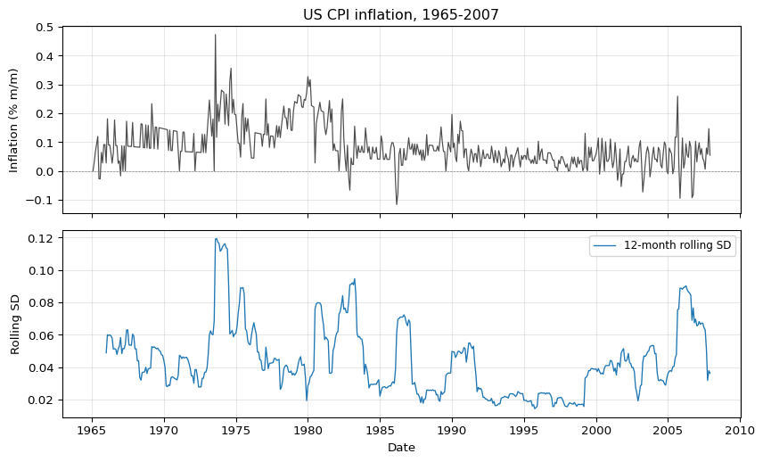
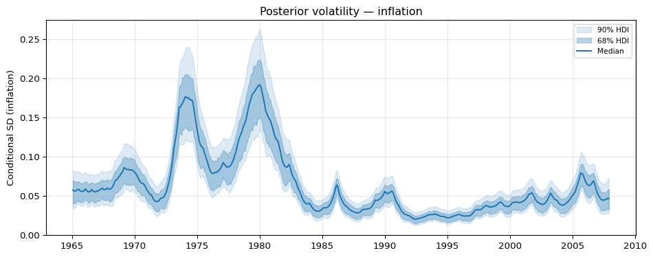
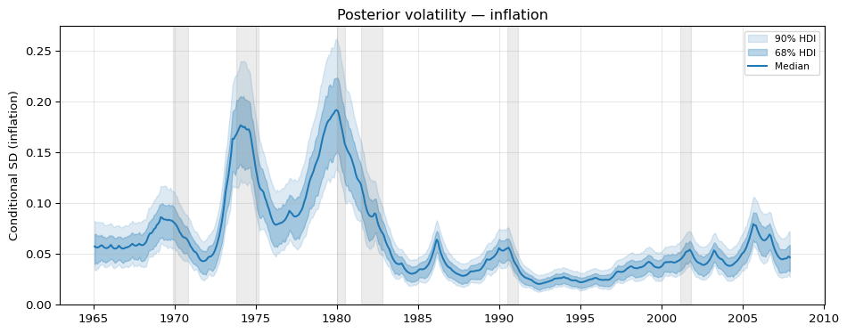
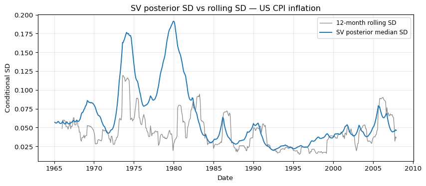
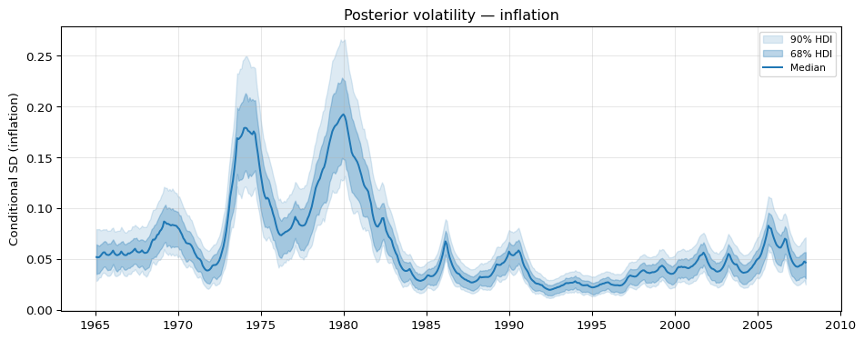
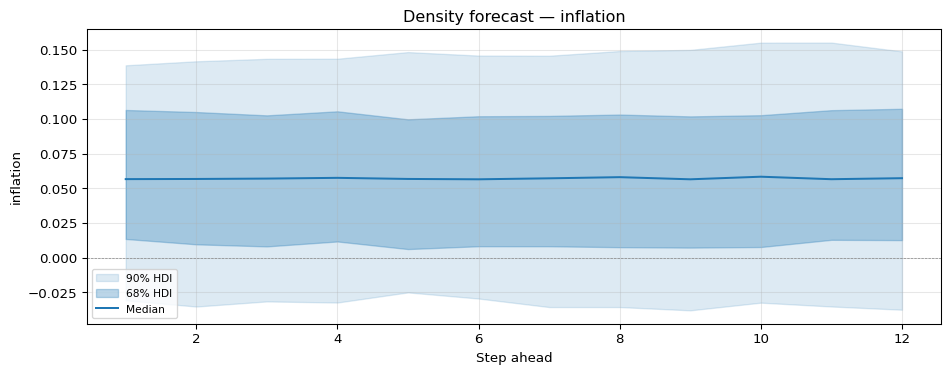

# Stochastic volatility: modelling time-varying uncertainty


## Why time-varying volatility matters

U.S. monthly CPI inflation is not a single well-behaved process. Look at any plot of the series from 1965 onward and two regimes jump out. The 1970s and early 1980s were a period of high and erratic inflation driven by oil shocks, wage-price dynamics, and a Federal Reserve that had not yet committed to disinflation. From the mid-1980s through the early 2000s the picture changed. Inflation settled at a lower level and its month-to-month variability collapsed. This calmer period is usually called the *Great Moderation*. A constant-variance model fitted over the full sample will average across these regimes, overstating the noise in quiet periods and understating it in turbulent ones.

Stochastic volatility (SV) models address this directly. Rather than assuming a single residual variance $\sigma^2$, we let the log of the conditional variance evolve as its own latent stochastic process. The observation equation says the series is centered at its mean and shocked by Gaussian noise whose scale depends on the latent log-volatility at that date; the state equation says log-volatility itself drifts or mean-reverts over time. The output is a posterior path of conditional standard deviations, one per observation, which tracks how uncertainty rises and falls across the sample.

In this notebook we fit two SV specifications to US CPI inflation: a random-walk log-volatility model, which places no anchor on the volatility level, and an AR(1) variant, which pulls log-volatility toward a long-run mean. We then use the fitted model to generate a density forecast whose width reflects genuine uncertainty about future volatility, not just about the conditional mean.

``` python
import arviz as az
import matplotlib.pyplot as plt
import numpy as np
import pandas as pd

from impulso.samplers import NUTSSampler
from impulso.sv import SVData, StochasticVolatility
```

## Data

We reuse the monthly macro dataset shipped with the monetary-policy tutorial. The file spans January 1965 to December 2007 and includes a CPI-like `prices` column expressed as $100 \times \log(\text{CPI})$. Month-on-month inflation, in percentage points, is the first difference of that column.

``` python
df = pd.read_csv("data/monetary_policy.csv", parse_dates=["date"], index_col="date")
inflation = (100.0 * np.log(df["prices"])).diff().dropna()
inflation.name = "inflation"
print(f"Observations: {len(inflation)}")
print(f"Range: {inflation.index.min():%Y-%m} to {inflation.index.max():%Y-%m}")
print("\nFirst five:")
print(inflation.head())
print("\nLast five:")
print(inflation.tail())
```

    Observations: 515
    Range: 1965-02 to 2007-12

    First five:
    date
    1965-02-01    0.000000
    1965-03-01    0.027839
    1965-04-01    0.064824
    1965-05-01    0.092282
    1965-06-01    0.119403
    Name: inflation, dtype: float64

    Last five:
    date
    2007-08-01    0.005777
    2007-09-01    0.079216
    2007-10-01    0.057631
    2007-11-01    0.146399
    2007-12-01    0.054065
    Name: inflation, dtype: float64

The resulting series is monthly CPI inflation in percent. It starts in February 1965, one month after the raw CPI series begins, and ends in December 2007.

<details class="code-fold">
<summary>Code</summary>

``` python
rolling_window = 12
rolling_sd = inflation.rolling(rolling_window).std()

fig, axes = plt.subplots(2, 1, figsize=(9, 5.5), sharex=True)
axes[0].plot(inflation.index, inflation.values, linewidth=0.9, color="0.3")
axes[0].axhline(0.0, color="grey", linewidth=0.5, linestyle="--")
axes[0].set_ylabel("Inflation (% m/m)")
axes[0].set_title("US CPI inflation, 1965-2007")
axes[0].grid(alpha=0.3)

axes[1].plot(
    rolling_sd.index,
    rolling_sd.values,
    linewidth=1.0,
    color="C0",
    label=f"{rolling_window}-month rolling SD",
)
axes[1].set_ylabel("Rolling SD")
axes[1].set_xlabel("Date")
axes[1].legend(loc="upper right", fontsize=9)
axes[1].grid(alpha=0.3)

fig.tight_layout()
```

</details>



The rolling standard deviation makes the regime shift obvious. Volatility is elevated in the 1970s, spikes around the early-1980s disinflation, and then settles into a much narrower band from the mid-1980s onward. A rolling window is a useful diagnostic but it is a crude estimator: the window is fixed, the weights are flat, and the implied volatility at date $t$ uses data from $t - 11$ through $t$ with no pooling toward a prior or adjacent periods. The SV model will give us a smoother, probabilistically coherent volatility path.

## Model

The random-walk stochastic volatility model is a two-equation state-space system. For the observed series $y_t$,

$$y_t = \mu + u_t, \qquad u_t \sim N\!\left(0,\, \exp(h_t)\right),

$$

and for the latent log-volatility $h_t$,

$$

h_t = h_{t-1} + \sigma_\eta\, \eta_t, \qquad \eta_t \sim N(0, 1).

$$

Here $\mu$ is the unconditional mean of the series, $h_t$ is the log of the conditional variance at date $t$, and $\sigma_\eta$ controls how fast log-volatility can move from one period to the next. The conditional standard deviation at $t$ is $\exp(h_t / 2)$, so a one-unit increase in $h_t$ multiplies the conditional SD by $e^{1/2} \approx 1.65$.

Modelling log-volatility rather than the variance or the SD directly has two practical advantages. First, $\exp(h_t)$ is strictly positive for any real-valued $h_t$, so the parameterisation cannot wander into infeasible regions. Second, movements in $h_t$ are symmetric: a change of $+0.5$ and a change of $-0.5$ correspond to multiplicative moves of the same magnitude in the SD, which makes the random-walk innovation assumption more plausible.

!!! note "Log-volatility parameterisation"

    We model the log of the conditional variance, $h_t$, rather than the SD or the variance itself. The conditional SD at date $t$ is $\exp(h_t / 2)$. Working on the log scale keeps the implied variance strictly positive for any real-valued $h_t$ and makes increments symmetric: equal-magnitude moves up and down in $h_t$ correspond to multiplicative moves of the same size in the conditional SD.

!!! note "NUTS on the SV likelihood"

    We sample the SV model with PyMC's NUTS using a non-centered reparameterisation of the latent log-volatility path. Non-centering lets Hamiltonian Monte Carlo traverse the funnel geometry induced by $\sigma_\eta$ without the auxiliary-mixture approximation introduced by Kim, Shephard and Chib (1998) to make the likelihood conditionally Gaussian.

## Fitting the random-walk SV model

We wrap the inflation series in an `SVData` container and fit a `StochasticVolatility` model with random-walk log-vol dynamics.

``` python
data = SVData.from_series(inflation, name="inflation")

if ci:
    sampler = NUTSSampler(draws=10, tune=50, chains=1, cores=1, random_seed=123)
else:
    sampler = NUTSSampler(
        draws=1500,
        tune=3000,
        chains=4,
        cores=4,
        target_accept=0.95,
        random_seed=123,
    )

fitted = StochasticVolatility(dynamics="random_walk").fit(data, sampler=sampler)
```

<style>
    :root {
        --column-width-1: 40%; /* Progress column width */
        --column-width-2: 15%; /* Chain column width */
        --column-width-3: 15%; /* Divergences column width */
        --column-width-4: 15%; /* Step Size column width */
        --column-width-5: 15%; /* Gradients/Draw column width */
    }
&#10;    .nutpie {
        max-width: 800px;
        margin: 10px auto;
        font-family: 'Segoe UI', Tahoma, Geneva, Verdana, sans-serif;
        //color: #333;
        //background-color: #fff;
        padding: 10px;
        box-shadow: 0 4px 6px rgba(0,0,0,0.1);
        border-radius: 8px;
        font-size: 14px; /* Smaller font size for a more compact look */
    }
    .nutpie table {
        width: 100%;
        border-collapse: collapse; /* Remove any extra space between borders */
    }
    .nutpie th, .nutpie td {
        padding: 8px 10px; /* Reduce padding to make table more compact */
        text-align: left;
        border-bottom: 1px solid #888;
    }
    .nutpie th {
        //background-color: #f0f0f0;
    }
&#10;    .nutpie th:nth-child(1) { width: var(--column-width-1); }
    .nutpie th:nth-child(2) { width: var(--column-width-2); }
    .nutpie th:nth-child(3) { width: var(--column-width-3); }
    .nutpie th:nth-child(4) { width: var(--column-width-4); }
    .nutpie th:nth-child(5) { width: var(--column-width-5); }
&#10;    .nutpie progress {
        width: 100%;
        height: 15px; /* Smaller progress bars */
        border-radius: 5px;
    }
    progress::-webkit-progress-bar {
        background-color: #eee;
        border-radius: 5px;
    }
    progress::-webkit-progress-value {
        background-color: #5cb85c;
        border-radius: 5px;
    }
    progress::-moz-progress-bar {
        background-color: #5cb85c;
        border-radius: 5px;
    }
    .nutpie .progress-cell {
        width: 100%;
    }
&#10;    .nutpie p strong { font-size: 16px; font-weight: bold; }
&#10;    @media (prefers-color-scheme: dark) {
        .nutpie {
            //color: #ddd;
            //background-color: #1e1e1e;
            box-shadow: 0 4px 6px rgba(0,0,0,0.2);
        }
        .nutpie table, .nutpie th, .nutpie td {
            border-color: #555;
            color: #ccc;
        }
        .nutpie th {
            background-color: #2a2a2a;
        }
        .nutpie progress::-webkit-progress-bar {
            background-color: #444;
        }
        .nutpie progress::-webkit-progress-value {
            background-color: #3178c6;
        }
        .nutpie progress::-moz-progress-bar {
            background-color: #3178c6;
        }
    }
</style>

<div class="nutpie">
    <p><strong>Sampler Progress</strong></p>
    <p>Total Chains: <span id="total-chains">4</span></p>
    <p>Active Chains: <span id="active-chains">0</span></p>
    <p>
        Finished Chains:
        <span id="active-chains">4</span>
    </p>
    <p>Sampling for now</p>
    <p>
        Estimated Time to Completion:
        <span id="eta">now</span>
    </p>
&#10;    <progress
        id="total-progress-bar"
        max="18000"
        value="18000">
    </progress>
    <table>
        <thead>
            <tr>
                <th>Progress</th>
                <th>Draws</th>
                <th>Divergences</th>
                <th>Step Size</th>
                <th>Gradients/Draw</th>
            </tr>
        </thead>
        <tbody id="chain-details">
            &#10;                <tr>
                    <td class="progress-cell">
                        <progress
                            max="4500"
                            value="4500">
                        </progress>
                    </td>
                    <td>4500</td>
                    <td>0</td>
                    <td>0.03</td>
                    <td>255</td>
                </tr>
            &#10;                <tr>
                    <td class="progress-cell">
                        <progress
                            max="4500"
                            value="4500">
                        </progress>
                    </td>
                    <td>4500</td>
                    <td>0</td>
                    <td>0.03</td>
                    <td>255</td>
                </tr>
            &#10;                <tr>
                    <td class="progress-cell">
                        <progress
                            max="4500"
                            value="4500">
                        </progress>
                    </td>
                    <td>4500</td>
                    <td>0</td>
                    <td>0.03</td>
                    <td>255</td>
                </tr>
            &#10;                <tr>
                    <td class="progress-cell">
                        <progress
                            max="4500"
                            value="4500">
                        </progress>
                    </td>
                    <td>4500</td>
                    <td>0</td>
                    <td>0.03</td>
                    <td>255</td>
                </tr>
            &#10;            </tr>
        </tbody>
    </table>
</div>

## The posterior volatility path

`fitted.volatility()` returns a `VolatilityResult` whose `.plot()` method shows the posterior median of $\exp(h_t / 2)$ together with a highest-density interval.

``` python
fig = fitted.volatility().plot()
fig.tight_layout()
```



To see how the volatility path lines up with the macroeconomic narrative we overlay NBER recession dates that fall within the sample. These are the recessions dated by the NBER Business Cycle Dating Committee that start on or after 1965 and end on or before December 2007.

``` python
fig = fitted.volatility().plot()
ax = plt.gcf().axes[0]
nber_recessions = [
    ("1969-12", "1970-11"),
    ("1973-11", "1975-03"),
    ("1980-01", "1980-07"),
    ("1981-07", "1982-11"),
    ("1990-07", "1991-03"),
    ("2001-03", "2001-11"),
]
for start, end in nber_recessions:
    ax.axvspan(pd.to_datetime(start), pd.to_datetime(end), alpha=0.15, color="gray")
fig.tight_layout()
```



The posterior volatility is elevated throughout the 1970s and peaks during the 1973-75 and 1980-82 recessions. From the mid-1980s onward the conditional SD drops to roughly a third of its 1970s level and stays there, with only mild bumps around the 1990-91 and 2001 recessions. This is the Great Moderation signature that a constant-variance model could not capture.

## Posterior SD versus rolling SD

How does the SV posterior compare with the naive 12-month rolling estimator we plotted earlier? We overlay them on the same axes.

``` python
posterior_sd = fitted.volatility().median()

fig, ax = plt.subplots(figsize=(9, 4))
ax.plot(
    rolling_sd.index,
    rolling_sd.values,
    color="0.55",
    linewidth=1.0,
    label=f"{rolling_window}-month rolling SD",
)
ax.plot(
    posterior_sd.index,
    posterior_sd["inflation"].values,
    color="C0",
    linewidth=1.5,
    label="SV posterior median SD",
)
ax.set_ylabel("Conditional SD")
ax.set_xlabel("Date")
ax.legend(loc="upper right", fontsize=9)
ax.grid(alpha=0.3)
ax.set_title("SV posterior SD vs rolling SD — US CPI inflation")
fig.tight_layout()
```



Both estimators agree on the big picture: high in the 1970s and early 1980s, low from the mid-1980s onward. The SV posterior is visibly smoother and avoids the sharp step changes the rolling estimator produces when a single unusual month enters or leaves the window. The posterior also pools information across the full sample through the random-walk prior on $h_t$, whereas the rolling SD uses only the most recent 12 observations.

## AR(1) dynamics for log-volatility

The random-walk specification places no anchor on the level of log-volatility: if $\sigma_\eta$ is small the path drifts slowly, if it is large the path wanders. An AR(1) alternative adds explicit mean reversion,

$$

h_t = \alpha + \phi\,(h_{t-1} - \alpha) + \sigma_\eta\, \eta_t,$$

with $|\phi| < 1$. This lets the data speak to whether log-volatility tends to return to a long-run level $\alpha$ and, if so, how fast. A persistence parameter $\phi$ posterior concentrated near 1 is consistent with the random-walk approximation being adequate; values meaningfully below 1 indicate stronger mean reversion than a pure random walk allows.

``` python
if ci:
    sampler_ar1 = NUTSSampler(draws=10, tune=50, chains=1, cores=1, random_seed=321)
else:
    sampler_ar1 = NUTSSampler(
        draws=1500,
        tune=3000,
        chains=4,
        cores=4,
        target_accept=0.95,
        random_seed=321,
    )

fitted_ar1 = StochasticVolatility(dynamics="ar1").fit(data, sampler=sampler_ar1)
fig_ar1 = fitted_ar1.volatility().plot()
fig_ar1.tight_layout()
```

<style>
    :root {
        --column-width-1: 40%; /* Progress column width */
        --column-width-2: 15%; /* Chain column width */
        --column-width-3: 15%; /* Divergences column width */
        --column-width-4: 15%; /* Step Size column width */
        --column-width-5: 15%; /* Gradients/Draw column width */
    }
&#10;    .nutpie {
        max-width: 800px;
        margin: 10px auto;
        font-family: 'Segoe UI', Tahoma, Geneva, Verdana, sans-serif;
        //color: #333;
        //background-color: #fff;
        padding: 10px;
        box-shadow: 0 4px 6px rgba(0,0,0,0.1);
        border-radius: 8px;
        font-size: 14px; /* Smaller font size for a more compact look */
    }
    .nutpie table {
        width: 100%;
        border-collapse: collapse; /* Remove any extra space between borders */
    }
    .nutpie th, .nutpie td {
        padding: 8px 10px; /* Reduce padding to make table more compact */
        text-align: left;
        border-bottom: 1px solid #888;
    }
    .nutpie th {
        //background-color: #f0f0f0;
    }
&#10;    .nutpie th:nth-child(1) { width: var(--column-width-1); }
    .nutpie th:nth-child(2) { width: var(--column-width-2); }
    .nutpie th:nth-child(3) { width: var(--column-width-3); }
    .nutpie th:nth-child(4) { width: var(--column-width-4); }
    .nutpie th:nth-child(5) { width: var(--column-width-5); }
&#10;    .nutpie progress {
        width: 100%;
        height: 15px; /* Smaller progress bars */
        border-radius: 5px;
    }
    progress::-webkit-progress-bar {
        background-color: #eee;
        border-radius: 5px;
    }
    progress::-webkit-progress-value {
        background-color: #5cb85c;
        border-radius: 5px;
    }
    progress::-moz-progress-bar {
        background-color: #5cb85c;
        border-radius: 5px;
    }
    .nutpie .progress-cell {
        width: 100%;
    }
&#10;    .nutpie p strong { font-size: 16px; font-weight: bold; }
&#10;    @media (prefers-color-scheme: dark) {
        .nutpie {
            //color: #ddd;
            //background-color: #1e1e1e;
            box-shadow: 0 4px 6px rgba(0,0,0,0.2);
        }
        .nutpie table, .nutpie th, .nutpie td {
            border-color: #555;
            color: #ccc;
        }
        .nutpie th {
            background-color: #2a2a2a;
        }
        .nutpie progress::-webkit-progress-bar {
            background-color: #444;
        }
        .nutpie progress::-webkit-progress-value {
            background-color: #3178c6;
        }
        .nutpie progress::-moz-progress-bar {
            background-color: #3178c6;
        }
    }
</style>

<div class="nutpie">
    <p><strong>Sampler Progress</strong></p>
    <p>Total Chains: <span id="total-chains">4</span></p>
    <p>Active Chains: <span id="active-chains">0</span></p>
    <p>
        Finished Chains:
        <span id="active-chains">4</span>
    </p>
    <p>Sampling for now</p>
    <p>
        Estimated Time to Completion:
        <span id="eta">now</span>
    </p>
&#10;    <progress
        id="total-progress-bar"
        max="18000"
        value="18000">
    </progress>
    <table>
        <thead>
            <tr>
                <th>Progress</th>
                <th>Draws</th>
                <th>Divergences</th>
                <th>Step Size</th>
                <th>Gradients/Draw</th>
            </tr>
        </thead>
        <tbody id="chain-details">
            &#10;                <tr>
                    <td class="progress-cell">
                        <progress
                            max="4500"
                            value="4500">
                        </progress>
                    </td>
                    <td>4500</td>
                    <td>0</td>
                    <td>0.08</td>
                    <td>767</td>
                </tr>
            &#10;                <tr>
                    <td class="progress-cell">
                        <progress
                            max="4500"
                            value="4500">
                        </progress>
                    </td>
                    <td>4500</td>
                    <td>0</td>
                    <td>0.11</td>
                    <td>127</td>
                </tr>
            &#10;                <tr>
                    <td class="progress-cell">
                        <progress
                            max="4500"
                            value="4500">
                        </progress>
                    </td>
                    <td>4500</td>
                    <td>0</td>
                    <td>0.09</td>
                    <td>255</td>
                </tr>
            &#10;                <tr>
                    <td class="progress-cell">
                        <progress
                            max="4500"
                            value="4500">
                        </progress>
                    </td>
                    <td>4500</td>
                    <td>0</td>
                    <td>0.09</td>
                    <td>127</td>
                </tr>
            &#10;            </tr>
        </tbody>
    </table>
</div>



The AR(1) volatility path should look qualitatively similar to the random-walk version on the bulk of the sample — the two disagree mostly at the tails, where the AR(1) prior pulls the path toward $\alpha$ while the random walk lets it drift. Inspecting the posterior of $\phi$ is the quickest way to decide whether that mean reversion is informative: if the mass sits very close to 1, the two specifications are almost indistinguishable.

## Density forecasts

With the random-walk SV fit we can generate a density forecast. For each posterior draw we simulate forward 12 months by evolving $h_{T+h}$ as $h_T + \sum_{s=1}^{h} \sigma_\eta \eta_s$ and then drawing $y_{T+h} = \mu + \exp(h_{T+h}/2)\, \varepsilon_{T+h}$.

``` python
forecast = fitted.forecast(steps=12)
fig_fcst = forecast.plot()
fig_fcst.tight_layout()
```



The fan widens with horizon because log-volatility under the random walk disperses geometrically: the variance of $h_{T+h}$ grows linearly in $h$, so the spread of plausible conditional SDs and therefore the spread of plausible $y_{T+h}$ values grows with the forecast step.

## Where this fits in Impulso

This notebook exercises the univariate SV functionality shipped in Layer 1 of Impulso’s stochastic-volatility roadmap. Layer 1 is deliberately standalone: `SVData`, `StochasticVolatility`, and `FittedSV` live in `impulso.sv` and are usable on any univariate series without touching the VAR pipeline. Layer 2 will introduce multivariate SV primitives, and Layer 3 will integrate SV residual dynamics into `impulso.VAR` so that reduced-form and structural analyses can share the time-varying-variance machinery. These layers connect the library to the applied literature on time-varying-parameter VARs with stochastic volatility — Primiceri (2005), Cogley and Sargent (2005), Clark (2011), and Carriero, Clark, and Marcellino (2016) — where SV residual dynamics are the workhorse for separating persistent changes in macroeconomic uncertainty from shifts in conditional means.

## References

- Carriero, A., Clark, T. E., and Marcellino, M. (2016). Common drifting volatility in large Bayesian VARs. *Journal of Applied Econometrics*, 31(2), 375-404.
- Clark, T. E. (2011). Real-time density forecasts from Bayesian vector autoregressions with stochastic volatility. *Journal of Business and Economic Statistics*, 29(3), 327-341.
- Cogley, T., and Sargent, T. J. (2005). Drifts and volatilities: Monetary policies and outcomes in the post-WWII U.S. *Review of Economic Dynamics*, 8(2), 262-302.
- Kim, S., Shephard, N., and Chib, S. (1998). Stochastic volatility: Likelihood inference and comparison with ARCH models. *Review of Economic Studies*, 65(3), 361-393.
- Primiceri, G. E. (2005). Time varying structural vector autoregressions and monetary policy. *Review of Economic Studies*, 72(3), 821-852.
